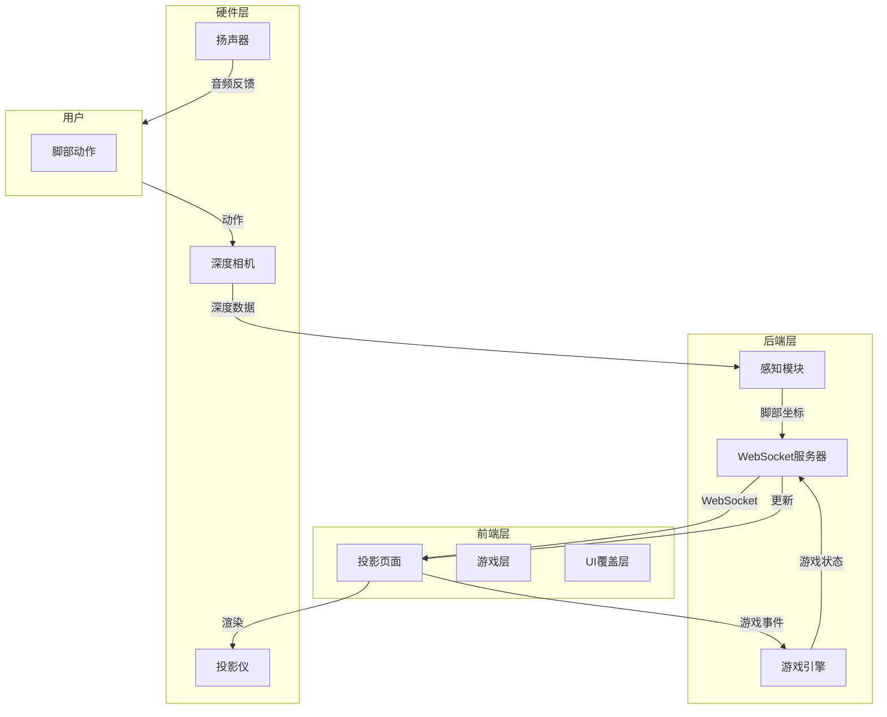
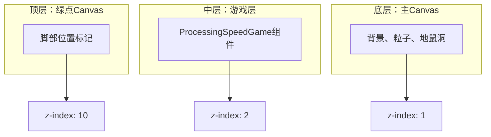
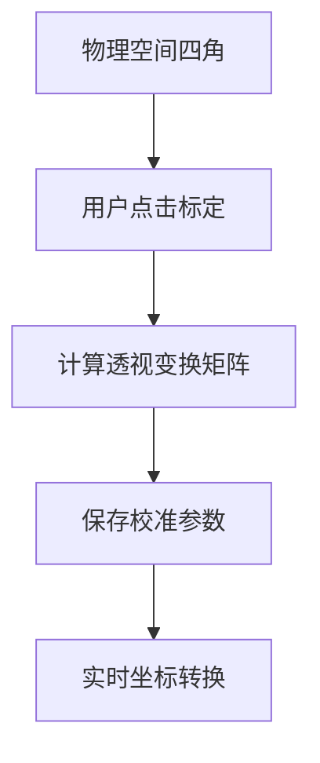
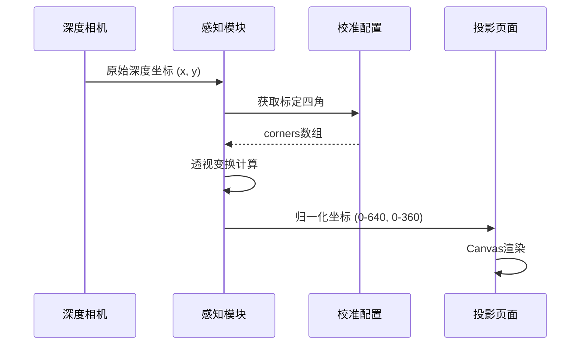
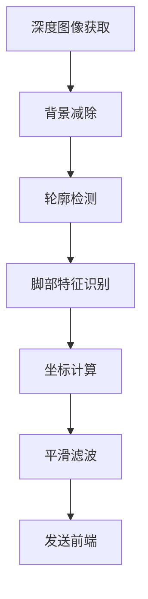
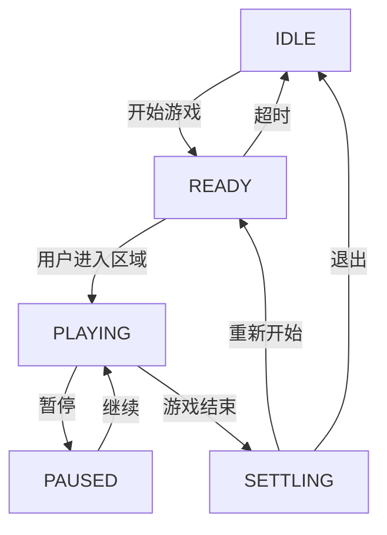
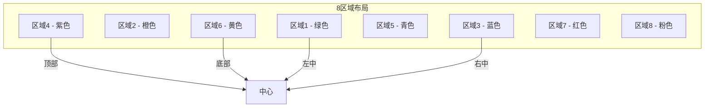
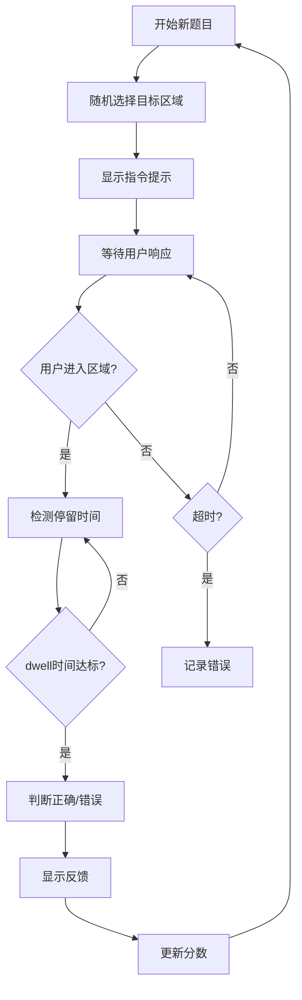
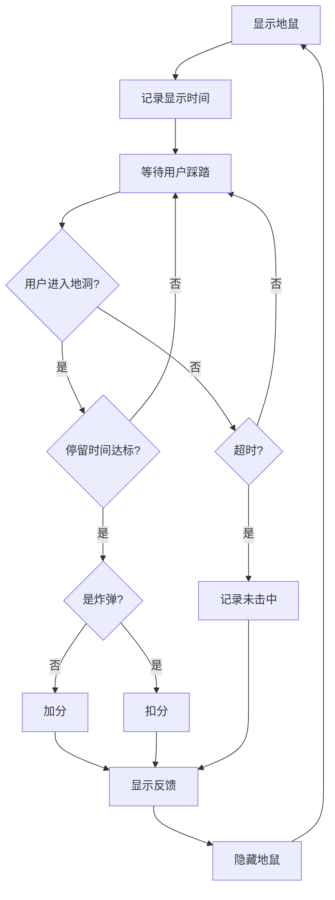
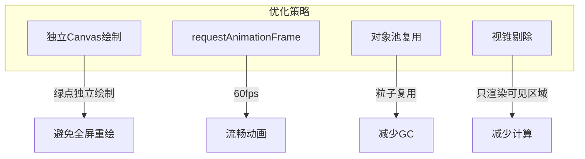

# 地面投影交互技术实现文档

## 目录
1. [系统概述](#系统概述)
2. [架构设计](#架构设计)
3. [投影校准系统](#投影校准系统)
4. [交互区域配置](#交互区域配置)
5. [脚部检测与追踪](#脚部检测与追踪)
6. [游戏集成架构](#游戏集成架构)
7. [处理速度训练游戏实现](#处理速度训练游戏实现)
8. [打地鼠游戏实现](#打地鼠游戏实现)
9. [前后端通信协议](#前后端通信协议)
10. [性能优化策略](#性能优化策略)

---

## 1. 系统概述

地面投影交互系统是一个基于计算机视觉的用户交互解决方案，通过投影技术将游戏界面投射到地面，用户通过脚部动作与系统进行交互。

### 1.1 核心能力

| 能力 | 描述 | 技术实现 |
|------|------|----------|
| **脚部检测** | 实时检测用户脚部位置 | 计算机视觉 + 深度传感器 |
| **投影校准** | 将投影区域与物理空间对齐 | 四点标定 + 透视变换 |
| **区域交互** | 识别用户在特定区域的停留 | 几何区域检测 + dwell时间判断 |
| **多游戏支持** | 支持多种认知训练游戏 | 模块化游戏引擎 |
| **实时反馈** | 视觉和听觉反馈 | Canvas渲染 + TTS |

### 1.2 系统架构图



---

## 2. 架构设计

### 2.1 三层Canvas架构

投影页面采用三层Canvas架构，确保渲染效率和交互准确性：



**设计说明**：
- **底层Canvas**：负责绘制背景、粒子效果和打地鼠游戏的地鼠洞
- **中层游戏层**：处理速度训练游戏的专用渲染层，独立组件管理
- **顶层绿点Canvas**：始终保持在最上层，显示用户脚部位置，独立绘制循环确保流畅性

### 2.2 核心组件职责

| 组件 | 文件路径 | 核心职责 |
|------|---------|---------|
| **Projection.vue** | `frontend/pages/projection.vue` | 投影主页面、Canvas管理、Socket通信 |
| **ProcessingSpeedGame.vue** | `frontend/components/ProcessingSpeedGame.vue` | 处理速度训练游戏逻辑 |
| **Perception Integrator** | `backend/perception/perception_integrator.py` | 脚部检测与坐标计算 |
| **Game Manager** | `backend/games/games_manager.py` | 游戏生命周期管理 |
| **Socket Server** | `backend/core/system_core.py` | WebSocket消息路由 |

---

## 3. 投影校准系统

### 3.1 校准原理

投影校准通过四点标定实现虚拟坐标与物理空间的映射：



### 3.2 校准配置数据结构

配置文件 `projection_config.json` 存储校准参数：

```json
{
  "corners": [
    [0.185, 0.135],  // 左上角 (归一化坐标)
    [0.768, 0.139],  // 右上角
    [0.687, 0.398],  // 右下角
    [0.264, 0.394]   // 左下角
  ],
  "zones": [...],
  "projection_bg": "#000000"
}
```

### 3.3 坐标转换流程



---

## 4. 交互区域配置

### 4.1 区域类型

系统支持多种交互区域类型：

| 类型 | 形状 | 配置参数 | 适用场景 |
|------|------|---------|---------|
| `rect` | 矩形 | points (4点坐标) | 处理速度训练的方形区域 |
| `circle` | 圆形 | center, radius | 打地鼠游戏的地洞 |
| `triangle` | 三角形 | points (3点坐标) | 特殊游戏区域 |

### 4.2 区域配置示例

```json
{
  "zones": [
    {
      "id": 1,
      "name": "区域1",
      "type": "rect",
      "color": "#33B555",
      "points": [[50, 80], [202, 80], [202, 280], [50, 280]]
    },
    {
      "id": 4,
      "name": "区域4",
      "type": "circle",
      "color": "#9C27B0",
      "center": [320, 93],
      "radius": 70
    }
  ]
}
```

### 4.3 区域检测算法

```python
def is_point_in_zone(point, zone):
    """判断点是否在区域内"""
    x, y = point
    zone_type = zone['type']
    
    if zone_type == 'rect':
        points = zone['points']
        min_x = min(p[0] for p in points)
        max_x = max(p[0] for p in points)
        min_y = min(p[1] for p in points)
        max_y = max(p[1] for p in points)
        return min_x <= x <= max_x and min_y <= y <= max_y
    
    elif zone_type == 'circle':
        cx, cy = zone['center']
        radius = zone['radius']
        dist = ((x - cx)**2 + (y - cy)**2)**0.5
        return dist <= radius
    
    # ... 其他形状检测
```

---

## 5. 脚部检测与追踪

### 5.1 检测流程



### 5.2 前端脚部渲染

绿点采用三层渐变设计，确保视觉清晰度：

```mermaid
flowchart TD
    subgraph FootPoint[绿点渲染]
        Outer[外圈光晕: rgba(51,181,85,0.25)]
        Middle[中圈渐变: #55ee77 → #228B22]
        Inner[内圈高光: rgba(255,255,255,0.95)]
    end
    
    Outer --> Middle
    Middle --> Inner
```

### 5.3 平滑滤波算法

为避免脚部抖动，采用指数移动平均（EMA）滤波：

```python
class FootTracker:
    def __init__(self, alpha=0.2):
        self.alpha = alpha  # 平滑系数
        self.smoothed_x = None
        self.smoothed_y = None
    
    def update(self, raw_x, raw_y):
        if self.smoothed_x is None:
            self.smoothed_x = raw_x
            self.smoothed_y = raw_y
        else:
            self.smoothed_x = self.alpha * raw_x + (1 - self.alpha) * self.smoothed_x
            self.smoothed_y = self.alpha * raw_y + (1 - self.alpha) * self.smoothed_y
        return (self.smoothed_x, self.smoothed_y)
```

---

## 6. 游戏集成架构

### 6.1 游戏状态机



### 6.2 游戏状态转换规则

| 状态 | 触发条件 | 下一状态 | 行为 |
|------|---------|---------|------|
| IDLE | 收到开始指令 | READY | 显示等待圈 |
| READY | 用户进入中心区域并停留3秒 | PLAYING | 开始游戏 |
| READY | 等待超过180秒无操作 | IDLE | 超时返回待机 |
| PLAYING | 收到暂停指令 | PAUSED | 显示暂停遮罩 |
| PLAYING | 计时器结束 | SETTLING | 显示结算画面 |
| SETTLING | 收到重新开始指令 | READY | 重置游戏数据 |

---

## 7. 处理速度训练游戏实现

### 7.1 游戏区域布局

处理速度训练使用8个交互区域，呈环形排列：



### 7.2 游戏逻辑流程



### 7.3 Go/No-Go模块

游戏核心是Go/No-Go范式，训练用户的抑制控制能力：

| 指令类型 | 目标区域 | 正确操作 | 错误操作 |
|---------|---------|---------|---------|
| STEP_ON_GREEN | 绿色区域 | 踩绿色 | 踩其他颜色 |
| STEP_ON_RED | 红色区域 | 踩红色 | 踩其他颜色 |
| DONT_STEP_ON_GREEN | 避开绿色 | 踩灰色/超时 | 踩绿色 |
| DONT_STEP_ON_RED | 避开红色 | 踩灰色/超时 | 踩红色 |

---

## 8. 打地鼠游戏实现

### 8.1 难度系统

打地鼠游戏包含8级难度，影响地鼠出现时间和炸弹概率：

| 难度 | 显示时间(ms) | 间隔(ms) | 炸弹概率 | 最大地鼠数 |
|------|------------|---------|---------|-----------|
| 1 | 2500 | 1800 | 0% | 1 |
| 2 | 2100 | 1500 | 8% | 1 |
| 3 | 1800 | 1300 | 12% | 2 |
| 4 | 1500 | 1100 | 16% | 2 |
| 5 | 1300 | 950 | 20% | 2 |
| 6 | 1100 | 800 | 25% | 3 |
| 7 | 900 | 700 | 30% | 3 |
| 8 | 750 | 600 | 35% | 3 |

### 8.2 游戏交互逻辑



---

## 9. 前后端通信协议

### 9.1 WebSocket消息格式

```json
{
  "type": "string",        // 消息类型
  "data": "object",       // 消息数据
  "timestamp": "number",  // Unix时间戳(毫秒)
  "session_id": "string"  // 会话ID
}
```

### 9.2 消息类型列表

| 类型 | 方向 | 说明 |
|------|------|------|
| `game_update` | 后端→前端 | 游戏状态更新 |
| `game_control` | 前端→后端 | 游戏控制指令 |
| `game_hit` | 前端→后端 | 打地鼠击中事件 |
| `game_action` | 前端→后端 | 处理速度训练动作 |
| `status` | 后端→前端 | 脚部位置更新 |
| `system_state` | 后端→前端 | 系统状态同步 |

### 9.3 游戏状态消息示例

```json
{
  "type": "game_update",
  "data": {
    "game_id": "processing_speed",
    "status": "PLAYING",
    "score": 150,
    "timer": 45,
    "difficulty_level": 3,
    "question": {
      "type": "STEP_ON_GREEN",
      "target_zone": 1
    },
    "remaining_time": 3.5,
    "in_interval": false,
    "stats": {
      "accuracy": 0.85
    }
  },
  "timestamp": 1778688175415
}
```

---

## 10. 性能优化策略

### 10.1 渲染优化



### 10.2 状态管理优化

```python
class GameStateManager:
    def __init__(self):
        self.state = 'IDLE'
        self.game_data = {}
        self.listeners = set()
    
    def update(self, new_state):
        if self.state != new_state:
            old_state = self.state
            self.state = new_state
            self.notify_listeners(old_state, new_state)
    
    def notify_listeners(self, old_state, new_state):
        for listener in self.listeners:
            listener(old_state, new_state)
```

### 10.3 网络优化

| 策略 | 实现方式 | 效果 |
|------|---------|------|
| 心跳检测 | 定期发送ping/pong | 及时检测连接断开 |
| 消息合并 | 批量发送状态更新 | 减少网络开销 |
| 优先级队列 | 紧急消息优先发送 | 保障实时性 |

---

## 参考文献

1. Dey, A. K. (2001). Understanding and Using Context. Personal and Ubiquitous Computing.
2. Csikszentmihalyi, M. (1990). Flow: The Psychology of Optimal Experience.
3. ISO 9241-210 (2010). Ergonomics of human-system interaction - Part 210: Human-centred design for interactive systems.
