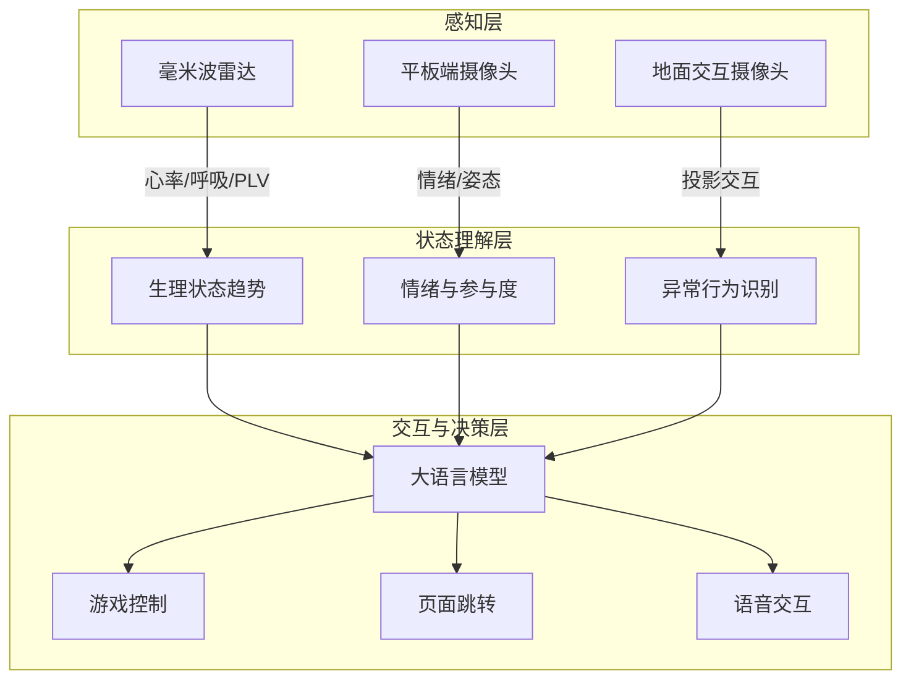
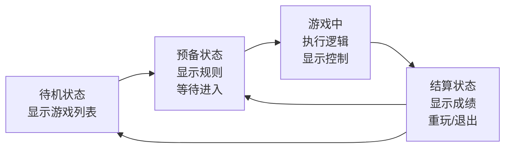
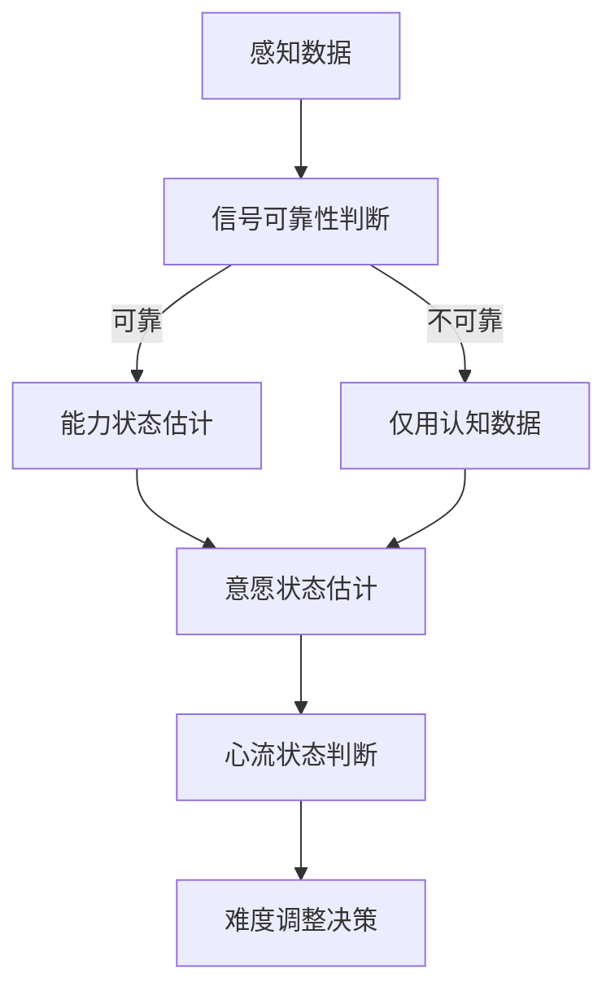
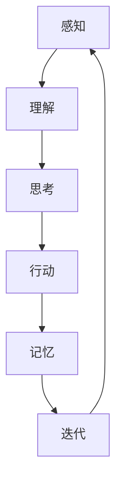
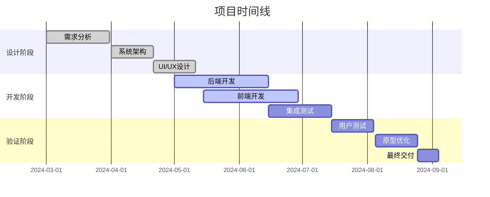
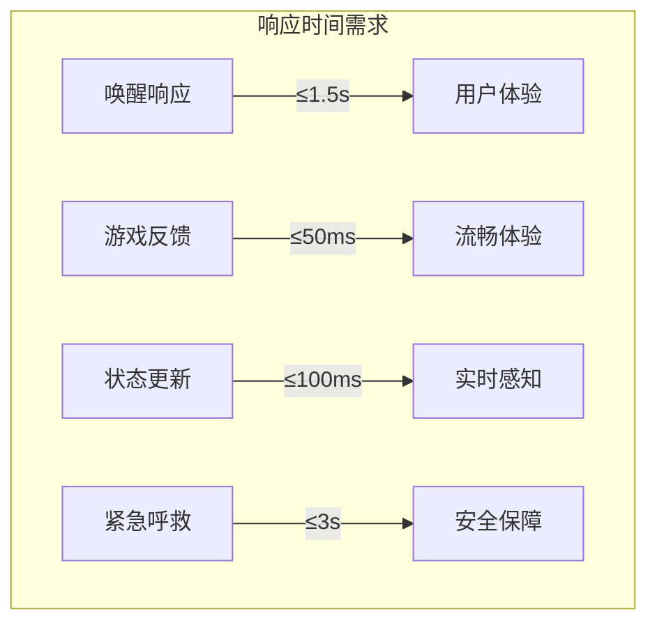

# 阿康（Akon）老年陪伴机器人 - 产品定义

---

## 1. 产品概述

### 1.1 产品名称
**阿康（Akon）** - 面向机构养老场景的多模态交互陪伴机器人

### 1.2 产品定位
一款融合 **健康监测、情感陪伴与认知训练** 的具身智能陪伴机器人，为老年人提供长期、低干扰的陪伴式健康管理服务，弱化技术干预感，建立符合老年人心理预期的平等互动关系。

### 1.3 核心价值主张
- **低干扰健康监测**：通过非接触式感知技术实现持续健康状态跟踪
- **状态驱动自适应交互**：根据老人身心状态动态调整陪伴与训练方式
- **投影式空间互动**：通过地面投影实现自然、直观的认知训练体验
- **个性化情感陪伴**：基于记忆与偏好的智能对话与内容推荐

---

## 2. 目标用户

### 2.1 核心用户画像
| 维度 | 描述 |
|------|------|
| **年龄** | 60-85岁 |
| **场景** | 机构养老、社区养老中心 |
| **健康状况** | 存在轻度认知衰退风险、希望维持认知能力的老年人 |
| **需求** | 需要健康管理、认知训练、情感陪伴的老年人 |
| **痛点** | 害怕被训练、被监测，需要更自然、有温度的互动方式 |

---

## 3. 系统架构

### 3.1 三层架构

### 3.2 硬件配置
- **毫米波雷达**：非接触式生理监测（心率、呼吸率、心肺耦合PLV、HRV分析），端口5020
- **平板端**：安卓平板（2560×1600，16:10 比例）
  - 前置摄像头：情绪识别、姿态分析、人脸识别
- **投影仪**：地面投影，投射认知训练界面
- **外置摄像头**：地面交互检测，识别人脚位置与交互
- **音箱**：语音合成与交互

---

## 4. 核心功能

### 4.1 健康监测系统
#### 4.1.1 非接触式生理监测
| 监测指标 | 技术实现 |
|----------|----------|
| **心率** | 毫米波雷达 (远程光电容积描记法) |
| **HRV** | 心率变异性分析 |
| **情绪状态** | 面部表情识别（开心/无聊/疲劳/困惑） |
| **姿态分析** | 坐立状态、活动量、身体动作 |
| **注意力** | 注视屏幕时间、眨眼频率 |

#### 4.1.2 健康看板
- 可视化展示情绪健康、睡眠健康、活动量等数据
- 提供生活建议与健康分析

### 4.2 投影式认知训练
#### 4.2.1 核心交互方式
- 投影仪将训练界面投射到地面
- 老人通过 **脚步 / 站位 / 停留** 与界面交互
- 支持平板端传统点击作为补充

#### 4.2.2 已实现游戏
| 游戏名称 | 训练目的 |
|----------|----------|
| **处理速度训练** | 基于 ACTIVE 研究，包含 Go/No-Go、选择反应、序列反应三个模块 |
| **打地鼠** | 锻炼反应速度与注意力 |

#### 4.2.3 游戏状态设计

### 4.3 情感陪伴系统
#### 4.3.1 语音交互
- **唤醒词**："阿康阿康"
- **自然对话**：大语言模型支持的智能问答
- **个性化响应**：基于记忆与偏好的个性化内容

#### 4.3.2 记忆机制
- **短期记忆**：刚才看了什么、玩了什么、情绪如何
- **长期记忆**：老人一生的偏好、薄弱项、喜欢的风格、最佳时间段

### 4.4 娱乐与内容系统
- 影视播放、音乐戏曲、舞蹈视频、报纸资讯
- 回忆相册（与认知训练联动）

---

## 5. UI 设计规范

### 5.1 色彩系统
| 类型 | 颜色 | 用途 |
|------|------|------|
| **主色** | #FF7222 (活力橙) | Logo、主按钮、核心品牌元素 |
| **正向色** | #33B555 (安全绿) | 情绪正向、挑战适中 |
| **警戒色** | #FB4422 (警戒红) | 情绪负面、压力过载 |
| **辅助色** | #FFD111 (温暖黄) | 温暖、舒适 |
| **辅助色** | #2AAADD (清爽蓝) | 清新、稳定 |
| **点缀色** | #1DD1BB (薄荷绿) | 活泼 |
| **点缀色** | #7555FF (极光紫) | 现代感 |

### 5.2 平板端界面结构
- 16:10 严格比例锁定
- 五大板块，侧边栏导航：
  - 🏠 **主页**：日期天气、语音通话、一键呼叫、三大入口
  - 💚 **健康**：健康看板、运动课程、生活建议
  - 🎵 **娱乐**：影视、音乐、舞蹈、资讯、回忆相册
  - 🧩 **益智**：认知训练/游戏、认知看板、学习内容
  - ⚙️ **账户**：个人设置与账户

---

## 6. 技术实现要点

### 6.1 动态难度调整（DDA）

### 6.2 "活系统" 核心循环

### 6.3 状态驱动决策
系统根据以下状态自主决策：
- **能力状态**：用户是否还有能力继续
- **意愿状态**：用户是否还愿意继续
- **心流状态**：挑战与能力是否平衡
- **风险状态**：是否存在异常或疲劳信号

---

## 7. 设计原则

### 7.1 核心设计原则
1. **安全优先**：异常状态检测、3秒响应要求
2. **心流维持**：动态调整难度，保持挑战与技能平衡
3. **多模态融合**：生理+情绪+行为综合分析
4. **适老化**：大字体、高对比度、简化交互
5. **情感连贯**：基于状态的自然反馈与持续互动

### 7.2 "活系统" 标准
系统满足以下 5 点，才算"活"：
1. ✅ **能感知环境**：老人在看什么、听什么、情绪如何、累不累
2. ✅ **能自己理解内容**：理解影视内容、人物关系、风格
3. ✅ **能自己产生目标**：判断现在该做什么训练
4. ✅ **能自己调用工具**：搜索图片音乐、生成游戏、调整难度
5. ✅ **能持续进化**：越用越懂老人，越用越聪明

---

## 8. 关键技术栈

| 层级 | 技术 |
|------|------|
| **前端** | Nuxt.js + Vue 3 + TypeScript |
| **后端** | Python + FastAPI |
| **大模型** | Qwen3.5 / Gemma (本地运行) |
| **语音** | Sherpa ASR (语音识别) + VITS (语音合成) |
| **视觉** | OpenCV + 毫米波雷达 + DeepFace |
| **通信** | WebSocket (实时双向) |
| **数据库** | SQLite + 本地文件存储 |

---

## 9. 预期成果

### 9.1 技术成果
- ✅ 可运行的完整原型系统
- ✅ 投影式地面交互实现
- ✅ 多模态状态感知与理解
- ✅ 大语言模型驱动的智能决策

### 9.2 研究验证
- 验证基于状态感知的自适应交互对持续参与度的影响
- 验证投影式空间训练在老年认知改善中的效果
- 验证"陪伴而非训练"的理念在老年接受度中的优势

---

## 10. 相关文件

| 文件 | 描述 |
|------|------|
| [INSTRUCTION.md](file:///c:/Users/purriste/Desktop/PYProject/rppg/开发文档/INSTRUCTION.md) | 详细的开发指南与规划 |
| [认知训练说明_Mermaid版.md](file:///c:/Users/purriste/Desktop/PYProject/rppg/认知训练说明_Mermaid版.md) | 认知训练模块详细说明 |
| [系统设计策略与方法框架文档_Mermaid版.md](file:///c:/Users/purriste/Desktop/PYProject/rppg/系统设计策略与方法框架文档_Mermaid版.md) | 系统架构与设计方法 |
| [地面投影交互技术实现文档.md](file:///c:/Users/purriste/Desktop/PYProject/rppg/地面投影交互技术实现文档.md) | 投影交互技术实现 |

---

## 11. 范围定义

### 11.1 功能范围

#### 11.1.1 核心功能（必须包含）

| 功能模块 | 功能点 | 描述 | 优先级 |
|----------|--------|------|--------|
| **健康监测** | 毫米波雷达心率检测 | 通过平板摄像头非接触式测量心率 | P0 |
| | HRV分析 | 心率变异性分析与压力评估 | P0 |
| | 情绪识别 | 面部表情识别（开心/无聊/疲劳/困惑） | P0 |
| | 姿态分析 | 坐立状态、活动量、身体动作 | P1 |
| | 健康看板 | 可视化展示健康数据与趋势 | P1 |
| **认知训练** | 处理速度训练 | Go/No-Go、选择反应、序列反应任务 | P0 |
| | 打地鼠游戏 | 反应速度与注意力训练 | P0 |
| | 动态难度调整 | 根据用户状态自适应调整难度 | P0 |
| | 训练记录 | 记录训练数据与效果分析 | P1 |
| **投影交互** | 地面投影显示 | 投射游戏界面到地面 | P0 |
| | 脚部检测 | 识别人脚位置与交互 | P0 |
| | 绿点追踪 | 实时显示脚部位置 | P0 |
| **语音交互** | 唤醒词检测 | "阿康阿康"唤醒 | P0 |
| | ASR识别 | 连续语音识别 | P0 |
| | TTS合成 | 语音合成响应 | P0 |
| | 智能对话 | 大语言模型驱动的问答 | P0 |
| **情感陪伴** | 记忆机制 | 短期记忆与长期记忆 | P1 |
| | 个性化推荐 | 基于偏好的内容推荐 | P1 |
| | 主动关怀 | 根据状态主动发起互动 | P1 |

#### 11.1.2 辅助功能（建议包含）

| 功能模块 | 功能点 | 描述 | 优先级 |
|----------|--------|------|--------|
| **娱乐系统** | 影视播放 | 电视剧、电影播放 | P2 |
| | 音乐戏曲 | 民歌、戏曲、收音机 | P2 |
| | 舞蹈视频 | 广场舞、交际舞教学 | P2 |
| | 资讯阅读 | 报纸、杂志、健康资讯 | P2 |
| | 回忆相册 | 照片展示与记忆联动 | P2 |
| **系统设置** | 用户管理 | 人脸识别登录、多账户支持 | P1 |
| | 参数配置 | 音量、唤醒灵敏度、确认时间 | P1 |
| | 网络设置 | 局域网配置、设备连接 | P1 |

#### 11.1.3 排除功能（明确不做）

| 功能 | 原因 | 未来考虑 |
|------|------|---------|
| **医疗诊断** | 非医疗设备，避免法律风险 | 可作为健康风险提示 |
| **远程监控** | 保护隐私，避免"被监控"感 | 可提供家属查看健康趋势 |
| **支付功能** | 超出陪伴机器人定位 | 未来可扩展 |
| **社交功能** | 超出当前项目范围 | 未来可扩展 |

### 11.2 技术边界

#### 11.2.1 硬件边界

| 设备 | 最低配置 | 推荐配置 | 限制 |
|------|---------|---------|------|
| **平板** | Android 8.0+, 2GB RAM, 2560×1600 | Android 10+, 4GB RAM, 2560×1600 | 必须16:10比例 |
| **投影仪** | 720p, 2000流明 | 1080p, 3000流明 | 支持地面投影 |
| **摄像头** | 720p@30fps, USB2.0 | 1080p@30fps, USB3.0 | 支持红外更佳 |
| **音箱** | 内置扬声器 | 外接蓝牙音箱 | 支持双向音频 |

#### 11.2.2 软件边界

| 软件 | 版本要求 | 用途 | 限制 |
|------|---------|------|------|
| **操作系统** | Windows 10+/Linux | 后端运行 | 不支持macOS |
| **浏览器** | Chrome/Edge 90+ | 前端界面 | 不支持Safari |
| **Python** | 3.10+ | 后端开发 | 必须虚拟环境 |
| **Node.js** | 18+ | 前端构建 | LTS版本 |

#### 11.2.3 数据边界

| 数据类型 | 采集范围 | 存储方式 | 保留期限 |
|----------|---------|---------|---------|
| **生理数据** | 心率、HRV | 本地SQLite | 30天 |
| **情绪数据** | 表情分类、参与度 | 本地JSON | 7天 |
| **交互日志** | 操作记录、游戏数据 | 本地文件 | 30天 |
| **用户数据** | 偏好、设置 | 本地SQLite | 永久 |
| **视频数据** | 不存储原始视频 | 实时处理 | 不保存 |

### 11.3 时间范围

#### 11.3.1 项目里程碑

#### 11.3.2 迭代周期

| 迭代 | 时间 | 目标 | 交付物 |
|------|------|------|---------|
| **V1.0** | 2024.Q2 | 核心功能实现 | 可运行原型 |
| **V1.1** | 2024.Q3 | 功能完善与优化 | 测试版 |
| **V1.2** | 2024.Q4 | 用户测试与迭代 | 正式版 |

### 11.4 地理与环境边界

| 维度 | 支持范围 | 不支持 |
|------|---------|--------|
| **地域** | 中国大陆 | 其他地区 |
| **语言** | 中文（普通话） | 其他语言 |
| **网络** | 局域网优先 | 公网依赖 |
| **光照** | 室内正常光照 | 强光直射/完全黑暗 |
| **人数** | 单人交互 | 多人同时交互 |

### 11.5 合规边界

| 合规要求 | 说明 | 执行方式 |
|----------|------|---------|
| **隐私保护** | 数据本地存储，不云端传输 | 不收集个人身份信息 |
| **安全加密** | 网络传输加密 | HTTPS/WSS |
| **适老化标准** | 符合老年用户使用习惯 | 大字体、高对比度 |
| **医疗声明** | 非医疗设备，仅供参考 | 界面明确提示 |

---

## 12. 技术需求

### 11.1 性能需求

#### 11.1.1 实时性要求
| 指标 | 需求描述 | 验证标准 |
|------|---------|---------|
| **视频延迟** | 摄像头视频流处理延迟 | ≤ 100ms |
| **脚部检测延迟** | 从用户移动到绿点响应 | ≤ 50ms |
| **语音响应延迟** | 唤醒词检测到TTS播放 | ≤ 1500ms |
| **状态更新频率** | 系统状态同步 | ≥ 30fps |
| **游戏帧速率** | 投影界面渲染 | ≥ 60fps |

#### 11.1.2 准确性要求
| 指标 | 需求描述 | 验证标准 |
|------|---------|---------|
| **心率检测准确率** | 毫米波雷达心率估计 | ≥ 90%（安静状态） |
| **情绪识别准确率** | 面部表情分类 | ≥ 80%（正面光照） |
| **脚部位置识别** | 投影区域定位 | 误差 ≤ 5cm |
| **唤醒词识别率** | "阿康阿康"唤醒 | ≥ 95%（5米内） |
| **语音识别准确率** | 连续语音识别 | ≥ 90%（普通话） |

### 11.2 安全需求

#### 11.2.1 数据安全
| 需求 | 描述 | 实现方式 |
|------|------|---------|
| **数据加密** | 所有网络传输数据 | HTTPS/WebSocket Secure |
| **本地存储** | 用户数据本地存储 | SQLite + 文件加密 |
| **隐私保护** | 不传输原始视频流 | 仅传输分析结果 |
| **数据清理** | 定期清理敏感数据 | 自动清理7天前临时数据 |

#### 11.2.2 异常处理
| 需求 | 描述 | 响应时间 |
|------|------|---------|
| **紧急呼救** | 检测到紧急语音指令 | ≤ 3秒响应 |
| **系统故障恢复** | 组件异常自动重启 | ≤ 10秒恢复 |
| **网络断连** | 离线模式支持 | 本地缓存，联网后同步 |

### 11.3 可用性需求

#### 11.3.1 适老化设计
| 需求 | 描述 | 规范标准 |
|------|------|---------|
| **字体大小** | 界面文字 | ≥ 24pt |
| **对比度** | 文本与背景 | ≥ 4.5:1 |
| **按钮尺寸** | 可触摸区域 | ≥ 48×48px |
| **响应时间** | 操作反馈 | ≤ 200ms |

#### 11.3.2 容错设计
| 需求 | 描述 | 处理方式 |
|------|------|---------|
| **误操作容忍** | 用户误触、超时 | 3秒确认机制 |
| **环境适应** | 低光照、多人场景 | 自适应阈值调整 |
| **网络波动** | 不稳定网络环境 | 消息队列重传 |

### 11.4 兼容性需求

#### 11.4.1 硬件兼容
| 设备类型 | 规格要求 | 支持程度 |
|----------|---------|---------|
| **平板** | Android 8.0+, 2560×1600 | 必须支持 |
| **投影仪** | 1080p+, 3000流明 | 推荐 |
| **摄像头** | 1080p@30fps, USB3.0 | 必须支持 |
| **音箱** | 蓝牙/AUX音频输出 | 必须支持 |

#### 11.4.2 软件兼容
| 软件 | 版本要求 | 用途 |
|------|---------|------|
| **IP Webcam** | 任意版本 | 平板视频传输 |
| **浏览器** | Chrome/Edge 90+ | 前端界面访问 |
| **Node.js** | 18+ | 前端构建 |
| **Python** | 3.10+ | 后端运行 |

### 11.5 扩展性需求

#### 11.5.1 模块扩展
| 模块 | 扩展方式 | 接口规范 |
|------|---------|---------|
| **游戏模块** | 插件化架构 | 统一生命周期接口 |
| **感知模块** | 可配置管道 | 标准化数据格式 |
| **语音模块** | 可替换引擎 | ASR/TTS接口抽象 |

#### 11.5.2 数据接口
| 接口类型 | 协议 | 格式 |
|----------|------|------|
| **实时通信** | WebSocket | JSON |
| **REST API** | HTTP/HTTPS | JSON |
| **文件上传** | HTTP Multipart | 二进制/JSON |

### 11.6 数据需求

#### 11.6.1 数据采集
| 数据类型 | 采集频率 | 存储周期 |
|----------|---------|---------|
| **心率数据** | 1次/秒 | 30天 |
| **情绪状态** | 1次/5秒 | 7天 |
| **交互日志** | 事件驱动 | 30天 |
| **游戏记录** | 每次游戏 | 90天 |
| **系统日志** | 持续 | 7天 |

#### 11.6.2 数据格式
| 数据项 | 格式 | 示例 |
|--------|------|------|
| **时间戳** | Unix毫秒 | 1778688175415 |
| **心率** | 整数（bpm） | 72 |
| **情绪** | 枚举字符串 | "happy", "neutral", "tired", "confused" |
| **位置** | 归一化坐标 | {"x": 0.5, "y": 0.3} |

### 11.7 实时性需求

#### 11.7.1 系统响应时间

### 12.8 可维护性需求

#### 12.8.1 代码质量
| 指标 | 标准 | 验证方式 |
|------|------|---------|
| **代码覆盖率** | ≥ 70% | 单元测试 |
| **静态检查** | 无错误警告 | pylint/eslint |
| **文档覆盖率** | ≥ 80% | 代码注释 |

#### 12.8.2 监控与日志
| 监控项 | 采集内容 | 告警阈值 |
|--------|---------|---------|
| **系统负载** | CPU/内存/磁盘 | >80%告警 |
| **服务状态** | 各模块健康度 | 离线告警 |
| **错误日志** | 异常堆栈 | 实时通知 |
| **性能指标** | 延迟/吞吐量 | 超过阈值告警 |

---

*最后更新：2025年5月15日*
