# 认知训练系统：完整设计策略与方法框架

## 目录
1. [系统概述与设计理念](#系统概述与设计理念)
2. [理论基础与文献综述](#理论基础与文献综述)
3. [系统架构蓝图](#系统架构蓝图)
4. [AI Core核心模块设计](#ai-core核心模块设计)
5. [前后端交互设计](#前后端交互设计)
6. [语音识别模块](#语音识别模块)
7. [页面架构设计](#页面架构设计)
8. [记忆机制设计](#记忆机制设计)
9. [交互形式设计](#交互形式设计)
10. [使用流程设计](#使用流程设计)
11. [技术路径图](#技术路径图)
12. [实现细节与代码架构](#实现细节与代码架构)

---

## 1. 系统概述与设计理念

### 1.1 系统定位

本系统是一个**面向老年人的多模态认知训练与健康监护平台**，融合了：

| 核心能力 | 技术实现 | 目标 |
|---------|---------|------|
| **认知训练** | 基于神经科学原理的Go/No-Go、选择反应任务 | 提升认知灵活性、注意力控制 |
| **健康监护** | 非接触式rPPG心率/呼吸率监测 | 长期健康状态跟踪 |
| **智能交互** | 语音唤醒、ASR、TTS、LLM对话 | 自然、无障碍的交互体验 |
| **情感关怀** | 面部表情识别、个性化反馈 | 提升用户满意度与参与度 |
| **安全响应** | 紧急呼救机制、异常检测 | 保障用户安全 |

### 1.2 设计理念金字塔

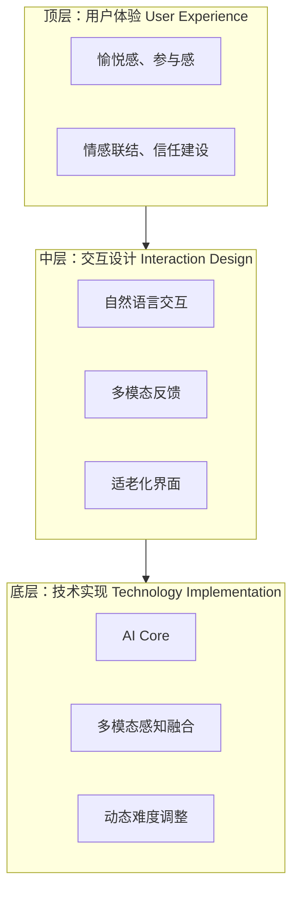

### 1.3 核心设计原则（学术依据）

| 原则 | 描述 | 文献依据 | 验证指标 |
|------|------|----------|----------|
| **适老化设计** | 大字体（≥24pt）、高对比度（≥4.5:1）、简化交互、大按钮（≥48x48px） | ISO 9241-210 (2010), Nielsen (2000) | 任务完成率、错误率 |
| **心流状态维持** | 动态难度调整，保持挑战与技能平衡，避免无聊或焦虑 | Csikszentmihalyi (1990), Sweetser & Wyeth (2005) | 持续参与时间、退出率 |
| **多模态融合** | 生理信号（心率）+ 情绪（表情）+ 行为（准确率）综合分析 | Picard (1997), D'Mello et al. (2008) | 状态估计准确度 |
| **安全优先** | 异常状态检测、紧急响应机制、3秒响应时间要求 | ISO 14971 (2019), NIST SP 800-66 | 响应延迟、误报率、漏报率 |
| **可持续参与** | 游戏化激励、个性化反馈、微目标设置 | Shute (2008), Kapp (2012) | 日活跃率、周留存率 |

---

## 2. 理论基础与文献综述

### 2.1 理论框架架构图

```mermaid
flowchart TD
    subgraph Flow[心流理论 Flow]
        F1[Csikszentmihalyi (1990)]
    end
    
    subgraph Adaptive[自适应学习系统]
        A1[Shute (2008)]
    end
    
    subgraph DDA[动态难度调整系统 DDA]
        D1[多模态输入]
        D2[分层状态估计]
        D3[证据融合决策]
    end
    
    subgraph Platform[适老化认知训练平台]
        P1[心流状态维持]
        P2[安全优先策略]
        P3[可持续参与设计]
    end
    
    F1 --> DDA
    A1 --> DDA
    DDA --> Platform
```

### 2.2 关键文献综述

#### 2.2.1 心流理论（Flow Theory）

| 学者 | 年份 | 核心贡献 | 本系统应用 |
|------|------|----------|-----------|
| **Csikszentmihalyi** | 1990 | 心流状态定义：挑战与技能的平衡，注意力高度集中、时间感知扭曲、内在动机驱动 | 通过DDA系统维持难度与能力匹配，避免无聊（难度过低）或焦虑（难度过高） |
| **Sweetser & Wyeth** | 2005 | 游戏Flow框架：8要素（平衡、反馈、目标、沉浸等） | 游戏设计时应用8要素原则 |
| **Nakamura & Csikszentmihalyi** | 2014 | 心流与积极心理学的关系 | 心流状态促进幸福感与长期参与 |

#### 2.2.2 动态难度调整（DDA）

| 学者 | 年份 | 核心贡献 | 本系统应用 |
|------|------|----------|-----------|
| **Hunicke** | 2005 | MEIP框架（Measure, Evaluate, Inference, Prescribe） | 本系统DDA的核心架构 |
| **Yannakakis & Hallam** | 2009 | 计算娱乐模型，基于玩家建模的个性化难度 | 多模态感知融合与玩家状态估计 |
| **Shute** | 2008 | 自适应学习系统设计原则 | 认知训练任务的难度适配 |
| **Andersen et al.** | 2010 | 实时DDA在严肃游戏中的应用 | 实时生理反馈驱动调整 |

#### 2.2.3 适老化交互设计

| 学者 | 年份 | 核心贡献 | 本系统应用 |
|------|------|----------|-----------|
| **Nielsen** | 2000 | 老年人设计指南：大字体、简化导航、清晰反馈 | UI设计核心原则 |
| **Czaja et al.** | 2006 | 老年人技术接受模型（TAM） | 降低学习曲线，提高接受度 |
| **Zajicek** | 2007 | 认知老化与界面设计 | 避免工作记忆过载 |
| **ISO 9241-210** | 2010 | 人因工程设计标准 | 可访问性设计依据 |

#### 2.2.4 多模态感知与情感计算

| 学者 | 年份 | 核心贡献 | 本系统应用 |
|------|------|----------|-----------|
| **Picard** | 1997 | 情感计算概念：计算机识别、理解、表达人类情感 | 情绪识别用于参与度估计 |
| **D'Mello et al.** | 2008 | 多模态学习状态检测 | 疲劳、注意力等状态融合 |
| **Cowie et al.** | 2001 | 情感标注与识别框架 | 情绪信号处理 |
| **Ekman** | 1972 | 基本情绪理论（6种情绪） | 情绪识别类别依据 |

### 2.3 理论基础矩阵

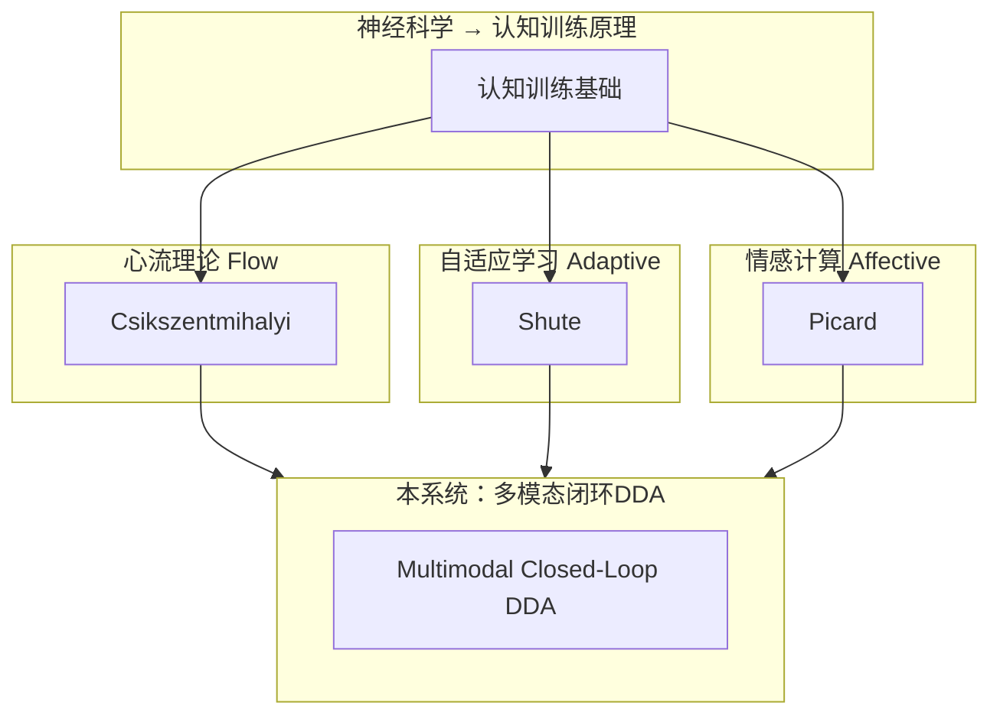

---

## 3. 系统架构蓝图

### 3.1 整体架构图（分层设计）

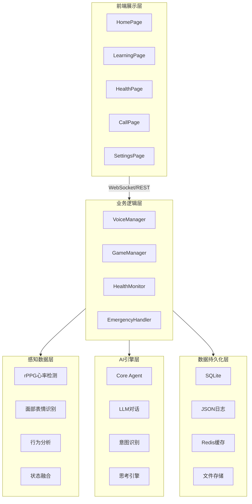

### 3.2 模块职责划分（详细）

| 模块 | 核心职责 | 技术实现 | 关键方法/API | 输入 | 输出 |
|------|---------|---------|-------------|------|------|
| **Frontend** | 用户界面展示、交互处理、状态可视化 | Vue 3 + TypeScript + Pinia | HomePage, LearningPage, CallPage | WebSocket消息 | UI渲染、用户交互 |
| **VoiceManager** | 语音唤醒、ASR识别、TTS合成、对话管理 | Sherpa ASR + VITS + WebSocket | process_recorded_audio(), speak(), navigate_to() | 语音音频 | 文本、音频、导航事件 |
| **GameManager** | 游戏生命周期管理、难度调整、训练记录 | 自定义游戏引擎 + DDA模块 | start_game(), update_game(), end_game() | 用户输入、难度参数 | 游戏状态、分数、难度 |
| **HealthMonitor** | 生理信号处理、健康状态评估、趋势分析 | OpenCV + NumPy + rPPG | process_frame(), estimate_health(), get_trends() | 视频帧、生理信号 | 心率、呼吸率、健康状态 |
| **EmergencyHandler** | 紧急呼救检测、安全响应、联系方式管理 | 电话API + WebSocket | detect_emergency(), initiate_call(), cancel_call() | 用户语音、意图识别结果 | 导航事件、电话呼叫、警报 |
| **Core Agent** | LLM推理、对话生成、意图理解、主动关怀 | Ollama (Gemma) + 提示工程 | ask_akon(), think(), get_agent_state() | 用户输入、世界状态 | 回复文本、action对象 |

---

## 4. AI Core核心模块设计

### 4.1 AI Core架构总图

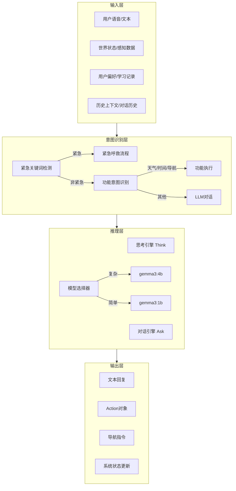

### 4.2 Core Agent状态机

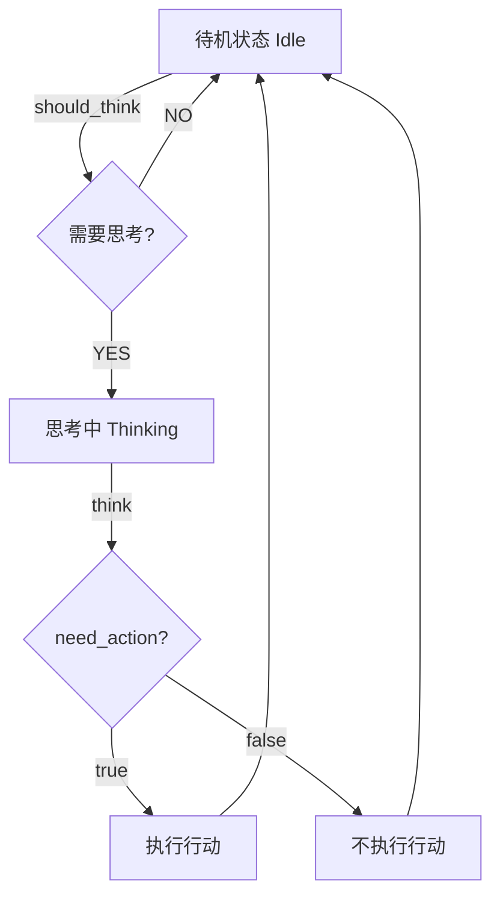

### 4.3 Core Agent思考引擎（Think Engine）详细设计

#### 4.3.1 思考触发条件

```python
def should_think(world_state: dict) -> bool:
    """判断是否需要思考 - 学术设计说明"""
    
    # 触发条件依据：基于注意力分配模型 (Anderson, 2004)
    # 只在必要时触发思考，避免计算资源浪费
    
    triggers = [
        # 条件1: 用户正在说话 → 需要响应
        perception.get("speaking", False),
        
        # 条件2: 活动状态变化 → 可能需要调整
        perception.get("activity_changed", False),
        
        # 条件3: 空闲超过15分钟 → 基于Boredom Detection (Eastin, 2004)
        perception.get("idleMinutes", 0) > 15,
        
        # 条件4: 用户明确请求 → 直接响应
        world_state.get("user_request"),
    ]
    return any(triggers)
```

**学术依据**：
- **注意力分配理论**（Anderson, 2004）：认知资源有限，只在必要时激活
- **无聊检测**（Eastin, 2004）：长时间无交互触发主动关怀
- **事件驱动架构**：避免轮询，降低资源消耗

#### 4.3.2 思考引擎工作流程

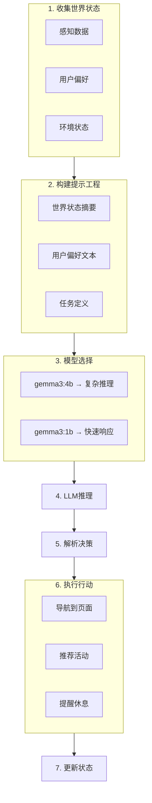

#### 4.3.3 提示工程设计（学术设计）

```python
def _build_think_prompt(world_state: dict, state_manager) -> str:
    """提示工程 - 学术设计说明"""
    
    # 设计原则：
    # 1. 角色定义："温暖的陪伴助手阿康" → 建立身份一致性
    # 2. 上下文注入：当前状态摘要 + 用户偏好 → 个性化
    # 3. 任务清晰化：明确关怀场景、输出格式 → 减少歧义
    # 4. 示例：JSON格式示例 → 降低理解成本
    # 5. 约束条件：说明何时需要行动 → 避免过度响应
    
    prompt = f"""你是阿康，一个主动关怀的陪伴助手。

当前状态：
{summary}

用户偏好：{prefs}

请判断是否需要主动关怀。如果需要，返回JSON：
{{"need_action": true, "action": "navigate/recommend/remind", "params": {{...}}, "speak": "要说的话"}}

关怀场景：
- 空闲超过15分钟 → 推荐活动（基于Boredom Detection）
- 疲劳度高 → 提醒休息（基于疲劳状态估计）
- 情绪低落 → 推荐娱乐（基于情感计算）

如果不需要行动，返回：{{"need_action": false}}"""

    return prompt
```

**学术依据**：
- **结构化提示**（Mishra et al., 2022）：明确输出格式，提高一致性
- **上下文注入**（Liu et al., 2023）：提供个性化信息，改进回复质量
- **少样本学习**（Brown et al., 2020）：示例引导模型理解任务
- **思维链**（Wei et al., 2022）：显式推理步骤（本系统中隐含于提示中）

### 4.4 对话引擎（Ask Engine）详细设计

#### 4.4.1 对话处理流程

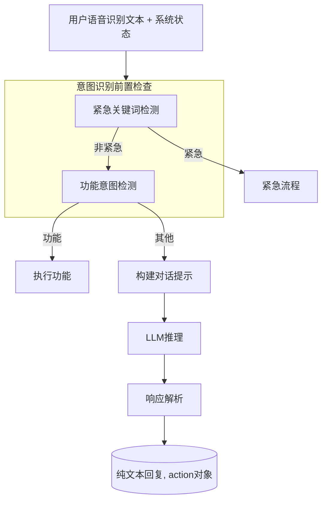

#### 4.4.2 响应解析器架构

```mermaid
flowchart TD
    Input[LLM响应原始文本] --> Parse1[尝试JSON解析]
    Input --> Parse2[正则标记解析]
    
    Parse1 -->|提取action| Combine[合并结果]
    Parse2 -->|[ACTION:路径]| Combine
    
    Combine --> Clean[清理响应文本]
    Clean --> Output[(回复文本, action)]
```

### 4.5 状态管理与记忆机制（学术设计）

#### 4.5.1 Agent状态模型

```python
class AkonAgentState:
    """Agent状态 - 基于有限状态机 (FSM) 设计"""
    
    def __init__(self):
        # 思考冷却机制：避免频繁思考，基于认知负荷理论 (Sweller, 1988)
        self.last_think_time = 0           # 上次思考时间
        self.min_think_interval = 3.0      # 最小思考间隔（秒）
        
        # 思考状态锁：防止并发思考
        self.thinking = False
```

**学术依据**：
- **认知负荷理论**（Sweller, 1988）：避免过度的信息处理需求
- **有限状态机**（FSM）：清晰的状态转换，可预测行为
- **资源节流**：防止API滥用和系统过载

#### 4.5.2 世界状态（World State）概念

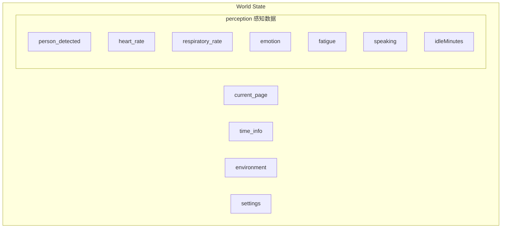

**学术依据**：
- **情境感知计算**（Dey, 2001）：系统感知并适应环境
- **情境模型**（Zacks et al., 2007）：人类认知中情境的重要性
- **状态估计**（Maybeck, 1979）：传感器融合与滤波

---

## 5. 前后端交互设计

### 5.1 交互泳道图（详细）

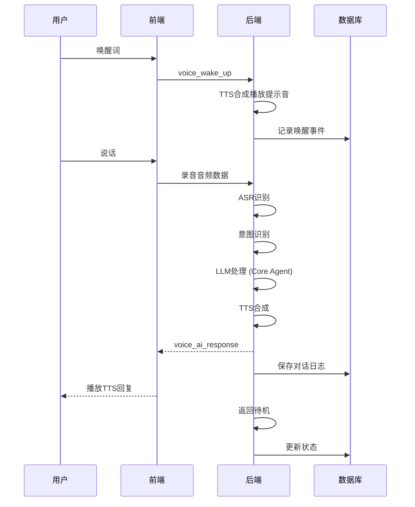

### 5.2 WebSocket消息协议（完整规范）

```json
// 消息格式规范
{
  "type": "string",        // 消息类型枚举
  "data": "object",       // 消息数据
  "timestamp": "number",  // Unix时间戳（毫秒）
  "session_id": "string", // 会话ID（用于会话连续性）
  "priority": "string"    // 优先级：high/normal/low（可选）
}

// 消息类型完整列表
{
  // ===== 语音相关 =====
  "voice_wake_up": "唤醒成功，准备聆听",
  "voice_listening": "正在聆听中",
  "voice_user_speak": "用户说话内容（文本）",
  "voice_processing": "正在处理中...",
  "voice_ai_response": "AI回复（文本+音频）",
  "voice_tts_start": "TTS开始播放",
  "voice_tts_end": "TTS播放结束",
  
  // ===== 导航相关 =====
  "navigate_to": "页面跳转指令",
  "navigate_back": "返回上一页",
  "navigate_home": "返回首页",
  
  // ===== 游戏相关 =====
  "game_start": "游戏开始",
  "game_update": "游戏状态更新",
  "game_score": "分数更新",
  "game_pause": "游戏暂停",
  "game_end": "游戏结束",
  "game_settling": "结算中",
  
  // ===== 健康相关 =====
  "health_update": "健康数据更新",
  "health_alert": "健康警报",
  "health_trend": "趋势数据",
  
  // ===== 紧急呼救 =====
  "emergency_detected": "检测到紧急情况",
  "emergency_call_initiated": "紧急呼叫发起",
  "emergency_call_cancelled": "紧急呼叫取消",
  "emergency_call_connected": "紧急呼叫接通",
  
  // ===== 系统状态 =====
  "system_ready": "系统就绪",
  "system_error": "系统错误",
  "state_sync": "完整状态同步"
}

// 数据结构示例 - voice_user_speak
{
  "type": "voice_user_speak",
  "data": {
    "text": "我感觉有点不舒服",
    "session_id": "session_12345",
    "timestamp": 1778688175415
  }
}

// 数据结构示例 - navigate_to
{
  "type": "navigate_to",
  "data": {
    "page": "/call",
    "params": {
      "emergency": true
    },
    "reason": "检测到紧急情况"
  }
}

// 数据结构示例 - voice_ai_response
{
  "type": "voice_ai_response",
  "data": {
    "text": "正在为您紧急呼救，请保持冷静",
    "action": {
      "type": "navigate",
      "page": "/call?emergency=true"
    },
    "audio_url": "/audio/emergency.mp3",
    "duration": 3.5
  }
}
```

### 5.3 状态同步机制（状态机设计）

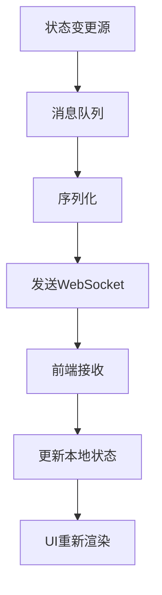

---

## 6. 语音识别模块

### 6.1 语音识别流程图

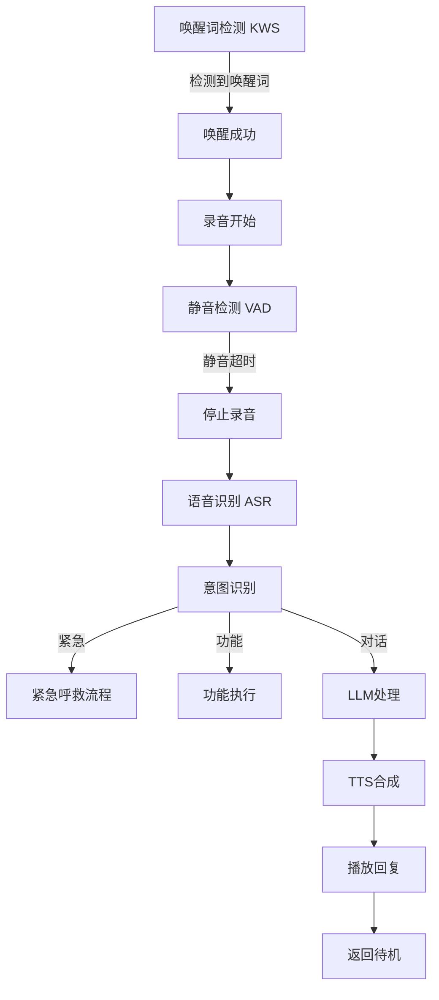

### 6.2 语音识别技术栈

| 组件 | 技术 | 说明 |
|------|------|------|
| 唤醒词检测 | Sherpa KWS | 轻量级关键词唤醒 |
| 语音识别 | Sherpa Streaming ASR | 流式语音识别 |
| 语音合成 | VITS | 端到端语音合成 |
| 音频处理 | Web Audio API | 前端音频处理 |
| 通信 | WebSocket | 实时双向通信 |

---

## 7. 页面架构设计

### 7.1 页面关系图

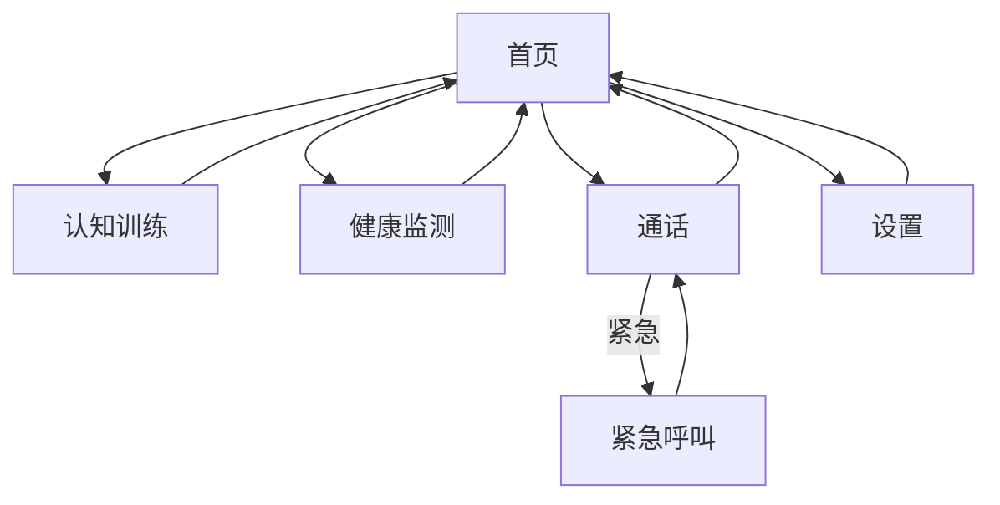

### 7.2 页面功能划分

| 页面 | 核心功能 | 技术实现 |
|------|---------|---------|
| **首页** | 健康卡片、快捷入口、状态概览 | Vue 3 + 响应式布局 |
| **认知训练** | Go/No-Go游戏、选择反应任务、难度调整 | 自定义游戏引擎 |
| **健康监测** | 心率/呼吸率显示、历史趋势、健康报告 | Chart.js + 数据可视化 |
| **通话** | 联系人列表、紧急呼叫、通话记录 | WebRTC + 电话API |
| **设置** | 音量调节、唤醒词设置、确认时间配置 | 表单验证 + 状态管理 |

---

## 8. 记忆机制设计

### 8.1 记忆系统架构

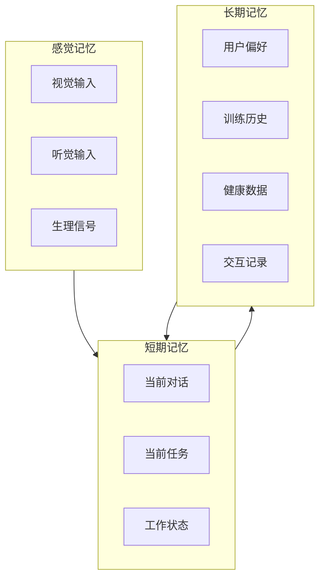

### 8.2 记忆机制表格

| 记忆类型 | 存储内容 | 保留时间 | 容量 | 用途 |
|---------|---------|---------|------|------|
| **感觉记忆** | 原始感知数据（音频、视频帧、生理信号） | <1秒 | 大 | 实时处理 |
| **短期记忆** | 当前对话、任务状态、系统状态 | 分钟级 | 有限 | 当前交互 |
| **长期记忆** | 用户偏好、训练历史、健康记录 | 持久 | 大 | 个性化、趋势分析 |

---

## 9. 交互形式设计

### 9.1 交互类型矩阵

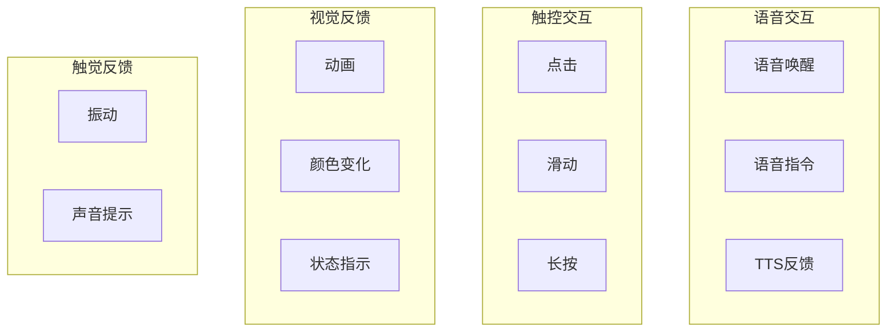

### 9.2 语音交互流程图

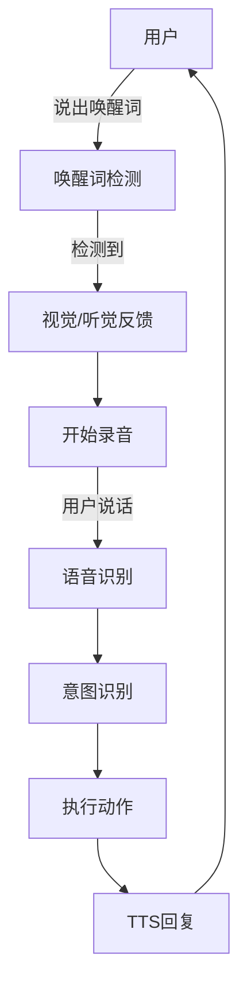

---

## 10. 使用流程设计

### 10.1 完整使用流程状态机

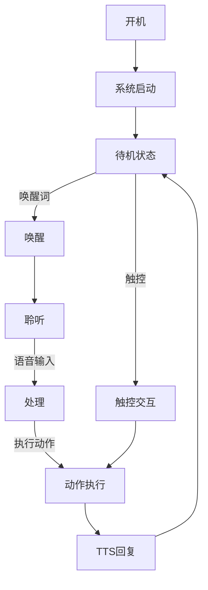

### 10.2 紧急呼叫流程

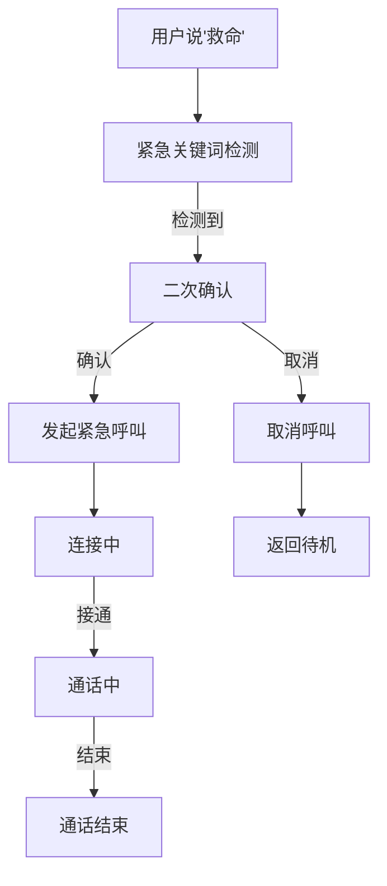

---

## 11. 技术路径图

### 11.1 技术栈架构

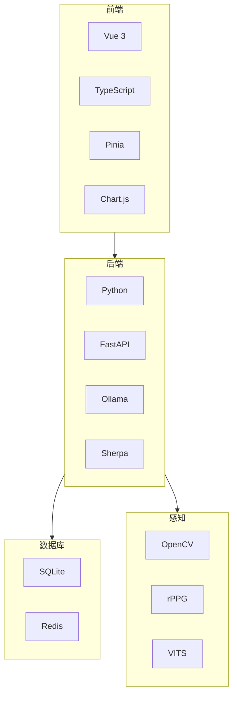

### 11.2 部署架构图

```mermaid
flowchart TD
    subgraph Client[客户端]
        C1[浏览器/Web App]
        C2[桌面端]
    end
    
    subgraph Server[服务器]
        S1[API服务]
        S2[LLM服务]
        S3[数据库]
    end
    
    Client -->|WebSocket| Server
    S1 --> S2
    S1 --> S3
```

---

## 12. 实现细节与代码架构

### 12.1 核心代码文件结构

```mermaid
flowchart TD
    subgraph backend/core
        CA[core_agent.py]
        VM[voice_manager.py]
        SC[system_core.py]
    end
    
    subgraph backend/perception
        PI[perception_integrator.py]
        HR[heart_rate.py]
        EM[emotion_recognizer.py]
    end
    
    subgraph backend/games
        GB[games_base.py]
        GM[games_manager.py]
        PS[processing_speed.py]
        DDA[difficulty_adjuster.py]
    end
    
    subgraph frontend
        F1[components]
        F2[views]
        F3[stores]
        F4[utils]
    end
    
    SC --> CA
    SC --> VM
    SC --> PI
    GM --> GB
    GM --> PS
    GM --> DDA
```

### 12.2 关键API接口

| 接口 | 方法 | 路径 | 功能 |
|------|------|------|------|
| 语音唤醒 | POST | /api/voice/wake | 唤醒词检测 |
| 语音识别 | POST | /api/voice/recognize | ASR识别 |
| 语音合成 | POST | /api/voice/speak | TTS合成 |
| LLM对话 | POST | /api/agent/ask | 对话交互 |
| 思考引擎 | POST | /api/agent/think | 主动思考 |
| 游戏开始 | POST | /api/game/start | 开始游戏 |
| 游戏状态 | GET | /api/game/status | 获取游戏状态 |
| 健康数据 | GET | /api/health/data | 获取健康数据 |
| 紧急呼叫 | POST | /api/emergency/call | 发起紧急呼叫 |

---

## 参考文献

1. Csikszentmihalyi, M. (1990). Flow: The Psychology of Optimal Experience
2. Shute, V. J. (2008). Focus on formative feedback. Review of Educational Research
3. Hunicke, R. (2005). AI and Dynamic Difficulty Adjustment. Game Developers Conference
4. Picard, R. W. (1997). Affective Computing. MIT Media Laboratory
5. Nielsen, J. (2000). Designing Web Usability
6. ISO 9241-210 (2010). Ergonomics of human-system interaction
7. Anderson, J. R. (2004). Cognitive Psychology and Its Implications
8. Dey, A. K. (2001). Understanding and Using Context
9. Sweller, J. (1988). Cognitive load during problem solving: Effects on learning
10. Wei, J. et al. (2022). Chain-of-Thought Prompting Elicits Reasoning in Large Language Models
