# 认知训练系统架构与实现文档

## 目录
1. [研究背景与理论基础](#研究背景与理论基础)
2. [系统整体架构](#系统整体架构)
3. [游戏系统架构](#游戏系统架构)
4. [动态难度调整（DDA）系统](#动态难度调整dda系统)
5. [处理速度训练游戏](#处理速度训练游戏)
6. [多模态感知融合](#多模态感知融合)
7. [分层状态估计（HSE）](#分层状态估计hse)
8. [证据融合机制](#证据融合机制)
9. [适老化安全机制](#适老化安全机制)

---

## 研究背景与理论基础

### 1.1 研究问题

在老年认知训练中，动态难度调整（Dynamic Difficulty Adjustment, DDA）的核心目标**不是让任务越来越难**，而是让老年用户在长期训练过程中持续维持可接受负荷与积极参与状态。

也就是说，系统真正需要解决的问题是：

1. **Can Continue**：用户现在还有没有能力继续训练？
2. **Want Continue**：用户现在还愿不愿意继续训练？

### 1.2 理论基础

本系统基于以下经典理论框架：

| 理论 | 学者 | 核心思想 |
|------|------|----------|
| **心流理论** | Csikszentmihalyi (1990) | 挑战与技能的动态平衡 |
| **自适应学习系统** | Shute (2008) | 基于学习者状态的动态调整 |
| **动态难度调整** | Hunicke (2005) | MEIP（体验式难度调整） |
| **Bloom认知分类** | Bloom (1956) | 认知过程的层级分类 |
| **项目反应理论** | Hambleton et al. (1991) | 个体能力与任务难度的匹配 |
| **情感计算** | Picard (1997) | 情感状态对认知的影响 |

### 1.3 为什么需要分层状态估计？

传统DDA系统往往采用**线性加权融合**：

```text
DifficultyScore = 0.3×accuracy + 0.2×emotion + 0.2×hrr + 0.3×rt
if score > threshold: increase_difficulty()
```

这种方法存在根本性问题：

**问题1：变量意义不可直接比较**
- accuracy 表示**能力**
- emotion 表示**意愿**
- 两者维度不同，直接相加没有意义

**问题2：生理信号需要上下文解释**
- 心率升高可能是**好事**（投入、兴奋、挑战）
- 也可能是**坏事**（焦虑、疲劳、压力）
- 必须联合其他信号综合判断

**问题3：老年场景强调安全性**
- 系统目标是 **maximize sustainable engagement**，而非 maximize challenge
- 解释性与安全性比刺激更重要

---

## 系统整体架构

### 2.1 完整分层状态机

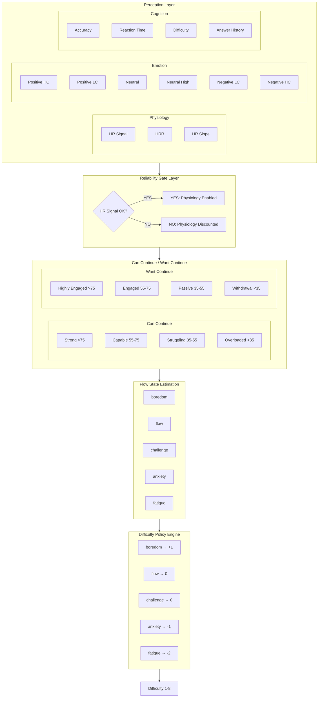

### 2.2 数据流图

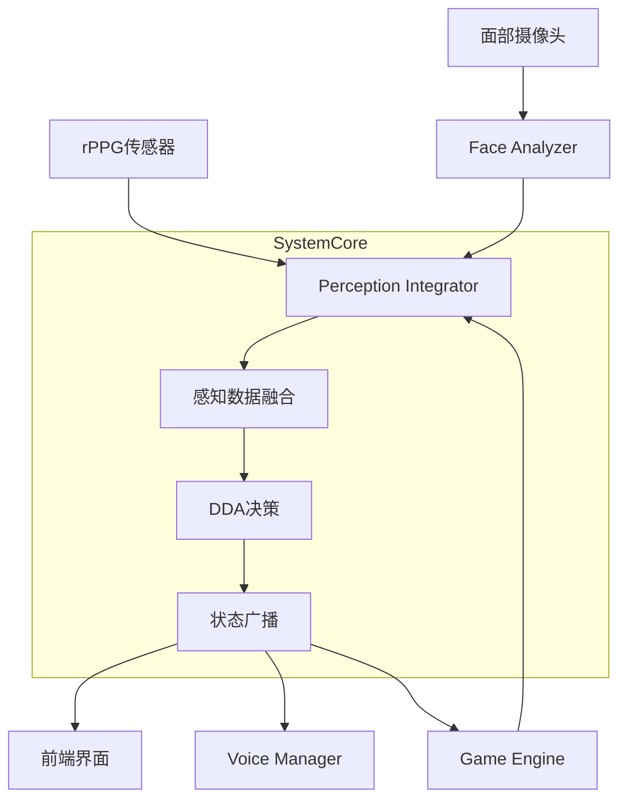

---

## 游戏系统架构

### 3.1 核心组件关系图

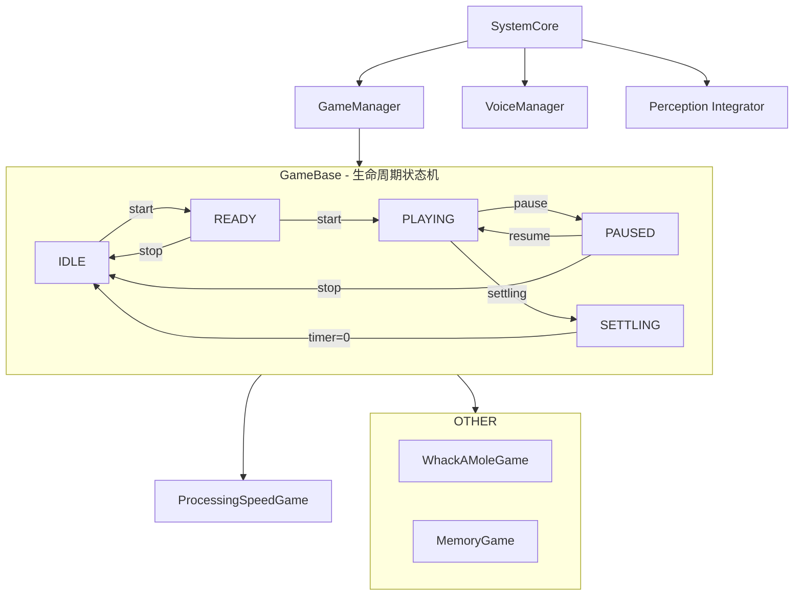

### 3.2 GameBase 生命周期钩子

```python
class GameBase(ABC):
    """游戏基类 - 定义标准游戏生命周期"""
    
    def set_ready(self):
        """进入 READY 状态 - 准备开始"""
        # 初始化分数、重置计时器
        # 调用 _on_ready() 子类钩子
    
    def start_game(self):
        """开始游戏 - 进入 PLAYING 状态"""
        # 记录开始时间
        # 调用 _on_start() 子类钩子
    
    def toggle_pause(self):
        """切换暂停状态"""
        # PLAYING ↔ PAUSED
        # 调用 _on_pause() / _on_resume()
    
    def start_settling(self):
        """进入结算 - SETTLING 状态"""
        # 显示结算画面
        # 调用 _on_settling() 子类钩子
    
    def stop(self):
        """停止游戏 - 返回 IDLE"""
        # 清理状态
        # 调用 _on_stop() 子类钩子
```

---

## 动态难度调整（DDA）系统

### 4.1 难度等级参数表

基于 Bloom 认知分类法和 IRT 项目反应理论，设计10级难度系统：

| 等级 | 名称 | 反应时间ms | 目标数量 | 持续时间ms | 间隔时间ms | 得分倍率 |
|------|------|-----------|----------|-----------|-----------|----------|
| 1 | 极易 | 3000 | 1 | 5000 | 3000 | 1.0× |
| 2 | 很易 | 2500 | 1 | 4500 | 2800 | 1.1× |
| 3 | 较易 | 2000 | 1 | 4000 | 2600 | 1.2× |
| 4 | 稍易 | 1800 | 2 | 3500 | 2400 | 1.3× |
| 5 | 适中 | 1500 | 2 | 3000 | 2200 | 1.5× |
| 6 | 稍难 | 1200 | 3 | 2500 | 2000 | 1.7× |
| 7 | 较难 | 1000 | 3 | 2000 | 1800 | 2.0× |
| 8 | 很难 | 800 | 4 | 1800 | 1600 | 2.5× |
| 9 | 极难 | 600 | 4 | 1500 | 1400 | 3.0× |
| 10 | 最难 | 500 | 5 | 1200 | 1200 | 4.0× |

⚠️ 老年人最高8级

### 4.2 难度调整决策流程

```mermaid
flowchart TD
    A[收集多源证据] --> B[信号可靠性门控]
    
    subgraph A[收集多源证据]
        A1[准确率趋势]
        A2[反应时间]
        A3[心率储备HRR]
        A4[情绪状态]
        A5[参与度]
    end
    
    subgraph B[信号可靠性门控]
        Q{HR Signal = OK?}
        Q -->|YES| USE[使用HR数据]
        Q -->|NO| IGNORE[忽略HR数据]
    end
    
    B --> C[计算调整幅度]
    
    subgraph C[计算调整幅度]
        C1[physical_load > 0.7] -->|yes| ADJ1[adjustment -= 1]
        C2[physical_load > 0.5] -->|yes| ADJ2[adjustment -= 0.5]
        C3[cognitive_load > 0.7] -->|yes| ADJ3[adjustment -= 1]
        C4[cognitive_load > 0.5] -->|yes| ADJ4[adjustment -= 0.5]
        C5[engagement < 0.3] -->|yes| ADJ5[adjustment -= 0.5]
        C6[all_optimal?] -->|yes| ADJ6[adjustment += 1]
    end
    
    C --> D[限制调整幅度]
    
    subgraph D[限制调整幅度]
        D1[max(-1, min(1, adjustment))]
    end
    
    D --> E[应用新难度]
    
    subgraph E[应用新难度]
        E1[new_level = current + adj]
    end
```

### 4.3 防抖机制（Anti-Oscillation）

```mermaid
flowchart TD
    A[当前难度: 4] --> B[本轮判断需要升]
    C[上一轮也是升]
    D[连续确认 ≥2次?]
    
    B --> D
    C --> D
    D -->|YES| E[执行升难度+1]
    D -->|NO| F[保持当前难度，继续观察]
    
    note over A,F: 防止: 4 → 5 → 4 → 5 → 4 (震荡)
    note over A,F: 实现: 必须连续2次同向判断才执行调整
```

---

## 处理速度训练游戏

### 5.1 游戏概念定义

| 概念 | 定义 | 难度调整 |
|------|------|----------|
| **dwell_time** | 进度圈从0%到100%的时间（用户在区域停留时间） | ❌ 固定（用户设置） |
| **answer_time** | 题目显示总时长 = dwell_time + extra_time | ✅ 主要难度变量 |
| **interval_time** | 两题之间的休息时间 | ❌ 固定 |
| **zones** | 激活的区域数量（3-8个） | ✅ 难度越高越多 |

### 5.2 游戏流程状态机

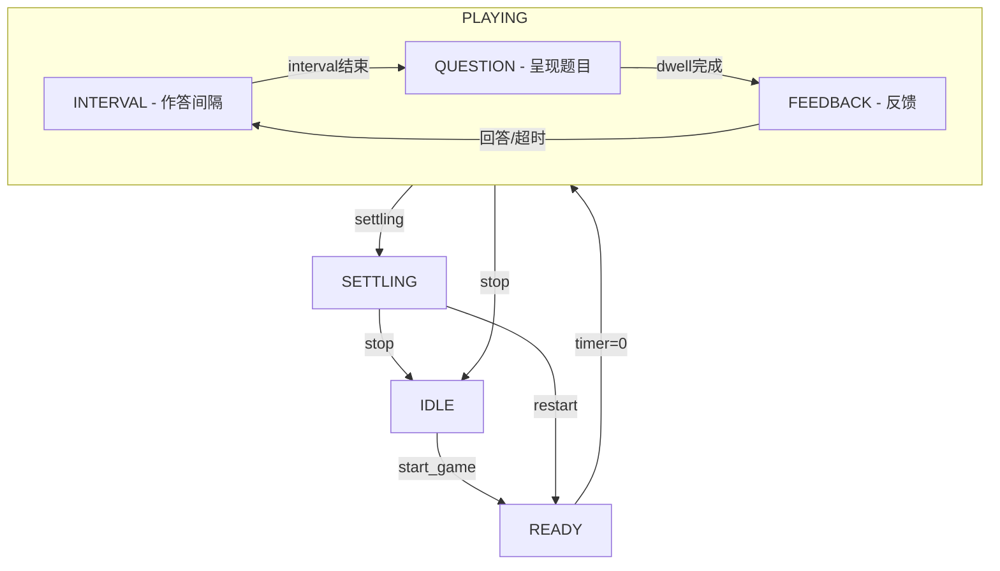

### 5.3 Go/No-Go 模块机制

```mermaid
flowchart TD
    subgraph STEP_GREEN[STEP_ON_GREEN]
        SG1[指令: 踩绿色!]
        SG2[目标: 绿色区域]
        SG3[踩绿色] --> SG_CORRECT[✓ 正确]
        SG4[踩红色] --> SG_WRONG[✗ 扣分]
        SG5[未踩任何] --> SG_TIMEOUT[✗ 错误]
    end
    
    subgraph STEP_RED[STEP_ON_RED]
        SR1[指令: 踩红色!]
        SR2[目标: 红色区域]
        SR3[踩红色] --> SR_CORRECT[✓ 正确]
        SR4[踩绿色] --> SR_WRONG[✗ 扣分]
        SR5[未踩任何] --> SR_TIMEOUT[✗ 错误]
    end
    
    subgraph DONT_GREEN[DONT_STEP_ON_GREEN]
        DG1[指令: 别踩绿色!]
        DG2[目标: 避开绿色]
        DG3[踩灰色] --> DG_CORRECT[✓ 抑制成功]
        DG4[踩绿色] --> DG_WRONG[✗ 冲动错误]
        DG5[未踩任何] --> DG_TIMEOUT[✓ 抑制成功]
    end
    
    subgraph DONT_RED[DONT_STEP_ON_RED]
        DR1[指令: 别踩红色!]
        DR2[目标: 避开红色]
        DR3[踩灰色] --> DR_CORRECT[✓ 抑制成功]
        DR4[踩红色] --> DR_WRONG[✗ 冲动错误]
        DR5[未踩任何] --> DR_TIMEOUT[✓ 抑制成功]
    end
    
    note over DONT_GREEN: ⚠️ 关键：超时 = 正确！训练抑制能力的核心
```

### 5.4 难度参数与题目难度

| 等级 | extra_time | zones | 作答时间示例 | 说明 |
|------|------------|-------|-------------|------|
| 1 | 5.0 | 3 | 7.0s | 极易，仅3个圈 |
| 2 | 4.5 | 4 | 6.5s | 很易，4个圈 |
| 3 | 4.0 | 5 | 6.0s | 较易，5个圈 |
| 4 | 3.5 | 6 | 5.5s | 稍易，6个圈 (默认) |
| 5 | 3.0 | 6 | 5.0s | 适中 |
| 6 | 2.5 | 7 | 4.5s | 稍难，7个圈 |
| 7 | 2.0 | 7 | 4.0s | 较难 |
| 8 | 1.5 | 8 | 3.5s | 很难，8个圈 (老人极限) |

作答时间计算公式：
`answer_time = dwell_time + extra_time`
约束: `answer_time ≥ dwell_time + 1.0秒`

---

## 多模态感知融合

### 6.1 三层证据系统

```mermaid
flowchart TD
    subgraph Layer1[第一层: 能力证据 Can Continue]
        L1Q[回答: 用户还有没有能力继续训练?]
        L1A[Accuracy Trend: 30%]
        L1B[RT Trend: 25%]
        L1C[Difficulty Tolerance: 20%]
        L1D[HRR: 15%]
        L1E[HR Slope: 10%]
    end
    
    subgraph Layer2[第二层: 意愿证据 Want Continue]
        L2Q[回答: 用户还愿不愿意继续?]
        L2A[Emotion Confidence: 45%]
        L2B[HRR Arousal: 20%]
        L2C[RT Hesitation: 20%]
        L2D[Accuracy Self-efficacy: 15%]
    end
    
    subgraph Layer3[第三层: 风险证据 Safety Override]
        L3Q[回答: 有没有危险信号需要立即响应?]
        L3A[HR Abnormal 连续>3次]
        L3B[Negative HC 连续≥2次]
        L3C[Accuracy崩塌 ≤20%]
        L3D[Sustained High HRR >60秒]
    end
    
    Layer1 --> Layer2
    Layer2 --> Layer3
    
    note over Layer3: ⭐ 最高优先级
```

### 6.2 生理数据解释矩阵

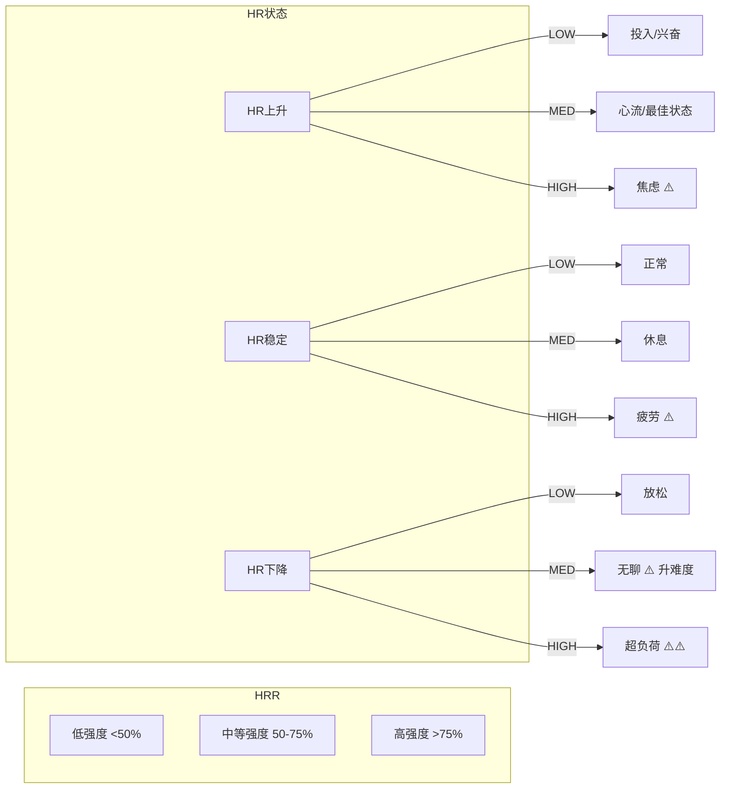

### 6.3 情绪状态评分映射

```mermaid
flowchart TD
    subgraph Positive[Positive]
        PH[积极高置信: +35分]
        PL[积极低置信: +15分]
    end
    
    subgraph Neutral[Neutral]
        NH[中性高置信: +10分]
        NL[中性低置信: +5分]
    end
    
    subgraph Negative[Negative]
        NGH[消极高置信: -40分 ⚠️⚠️]
        NGL[消极低置信: -15分]
    end
    
    Positive --> Neutral
    Neutral --> Negative
    
    note over Negative: ⚠️ 消极高置信 = 强负面信号
    note over Negative: 老年人挫败代价很高，惩罚力度最强
```

---

## 分层状态估计（HSE）

### 7.1 Can Continue 状态机

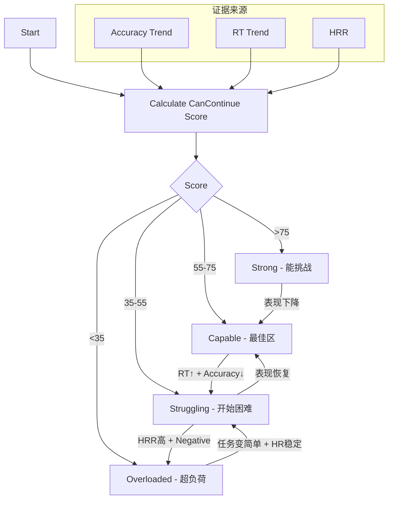

### 7.2 Want Continue 状态机

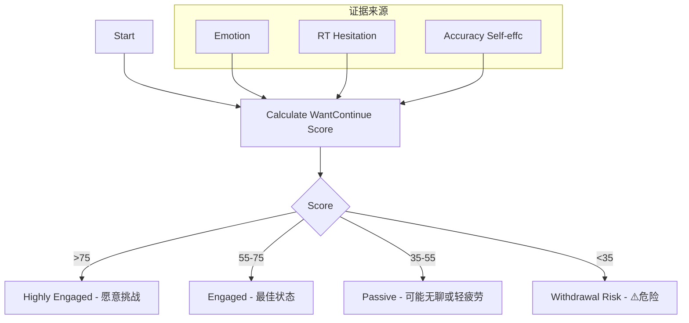

### 7.3 心流状态二维映射

```mermaid
flowchart LR
    subgraph Y[Want Continue]
        HE[Highly Engaged]
        E[Engaged]
        P[Passive]
        WR[Withdrawal Risk]
    end
    
    subgraph X[Can Continue]
        S[Strong]
        C[Capable]
        St[Struggling]
        O[Overloaded]
    end
    
    S -->|x HE| B[boredom]
    S -->|x E| F1[flow]
    C -->|x E| F2[flow]
    St -->|x E| Ch[challenge]
    St -->|x P| A[anxiety]
    O -->|x P| Ft1[fatigue]
    O -->|x WR| Ft2[fatigue]
    
    note over B,Ft2: 状态策略:
    note over B,Ft2: boredom→+1, flow→0, challenge→0, anxiety→-1, fatigue→-2
```

---

## 证据融合机制

### 8.1 Evidence ≠ 加权平均

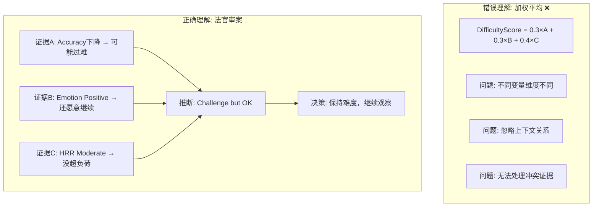

### 8.2 冲突证据处理

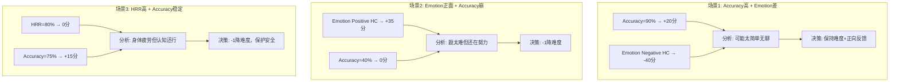

---

## 适老化安全机制

### 9.1 Safety Override 状态机

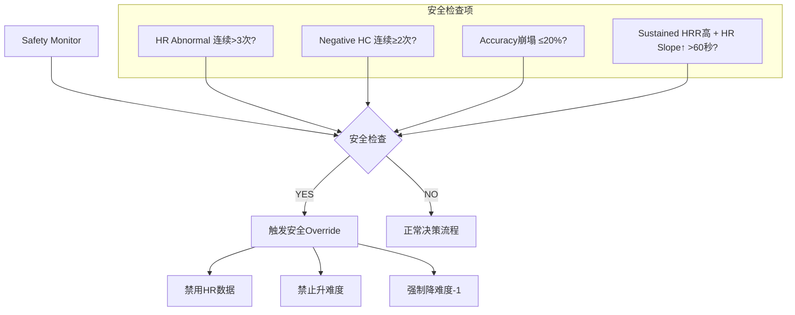

### 9.2 老年适配核心原则

```mermaid
flowchart TD
    P1[宁可略简单，也不要长期挫败]
    P2[保守升难度，积极降难度]
    P3[情绪信号 > 行为信号]
    P4[生理安全 > 认知训练]
    
    P1 --> P2
    P2 --> P3
    P3 --> P4
    
    note over P1: • 老人挫败后退出率很高
    note over P1: • 稍简单仍有训练收益
    
    note over P2: • 升难度: 连续2次确认
    note over P2: • 降难度: 单次警告即可
    
    note over P3: • 情绪变化先于表现变化
    note over P3: • 中性可能是深度专注
    
    note over P4: • 安全信号优先处理
    note over P4: • HR异常时宁可不用数据
```

---

## 文件结构

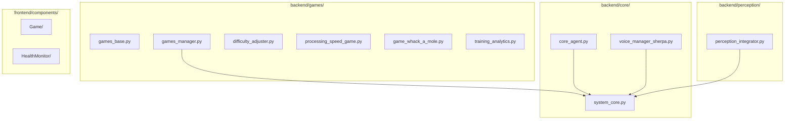

---

## 总结

### 系统核心创新点

1. **分层状态估计（HSE）**
   - 不直接根据输入调难度，而是先理解用户状态
   - 解耦"能力状态"与"意愿状态"
   - 这是"状态驱动系统"而非"规则驱动系统"

2. **证据融合机制**
   - 每个模态只是"证据"而非真相
   - 法官审案式综合推理
   - 冲突证据有明确的处理策略

3. **适老化安全优先**
   - 保守升难度，积极降难度
   - Safety Override 最高优先级
   - 宁可不用数据，也不要误判

4. **防抖稳定性机制**
   - 连续确认才执行调整
   - 避免难度震荡
   - 提高系统稳定性

### 核心理念

> **系统的目标不是追求难度最大化，而是追求参与度最优化。**
> 
> 对于老年认知训练，长期可持续的参与比短期高强度更有价值。

---

## 参考文献

1. Csikszentmihalyi, M. (1990). Flow: The Psychology of Optimal Experience
2. Shute, V. J. (2008). Focus on formative feedback. Review of Educational Research
3. Hunicke, R. (2005). AI and Dynamic Difficulty Adjustment. Game Developers Conference
4. Bloom, B. S. (1956). Taxonomy of Educational Objectives
5. Hambleton, R. K. et al. (1991). Fundamentals of Item Response Theory
6. Picard, R. W. (1997). Affective Computing. MIT Media Laboratory
