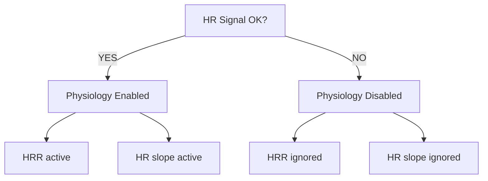
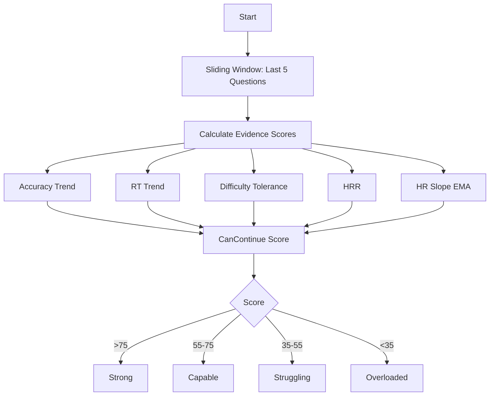
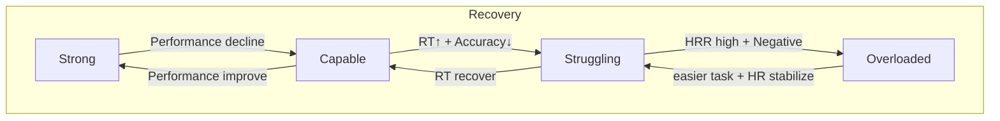
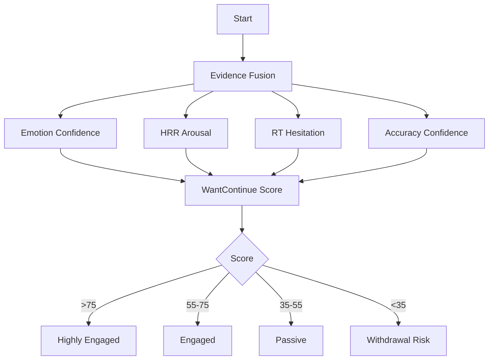
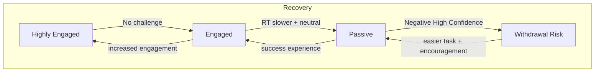
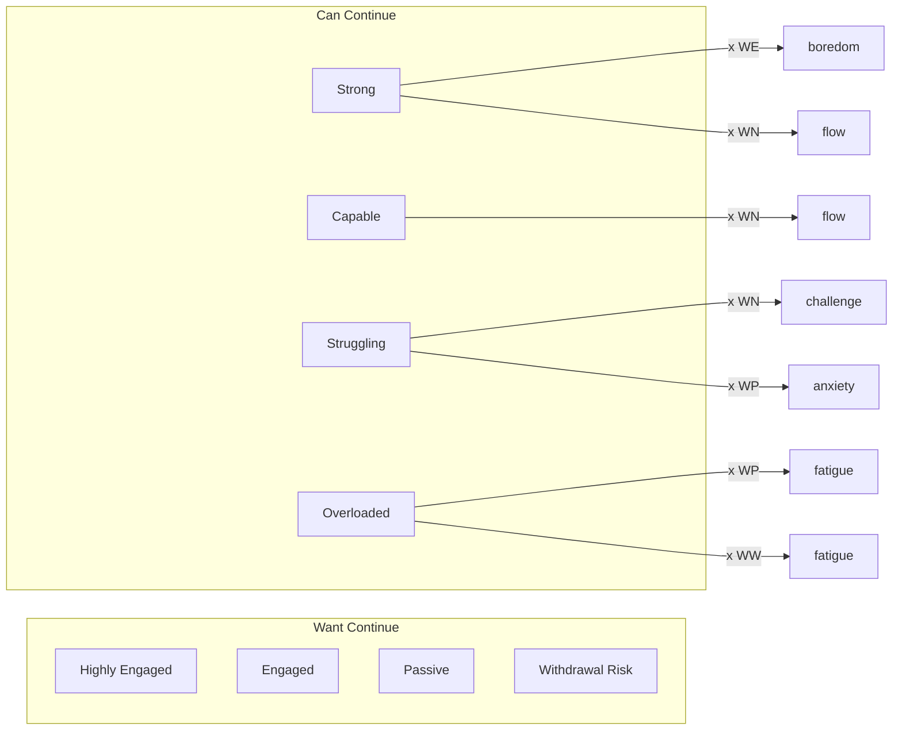
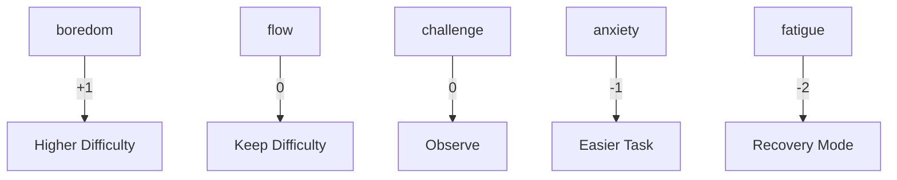
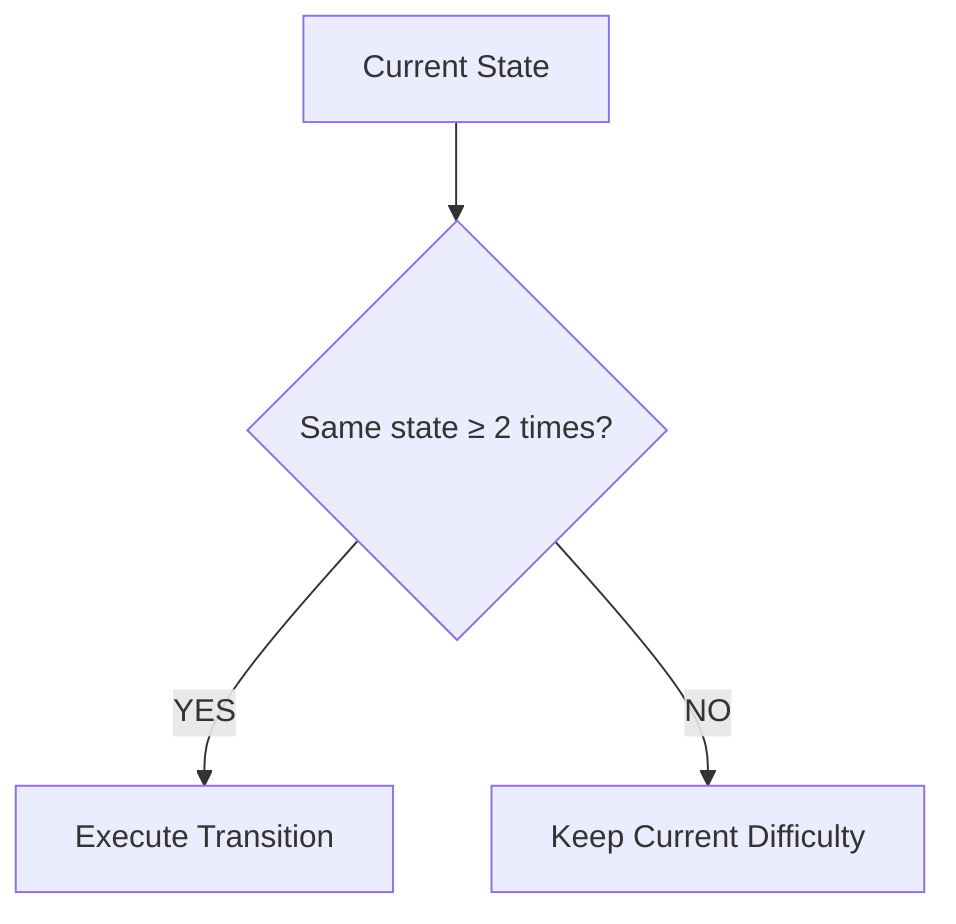
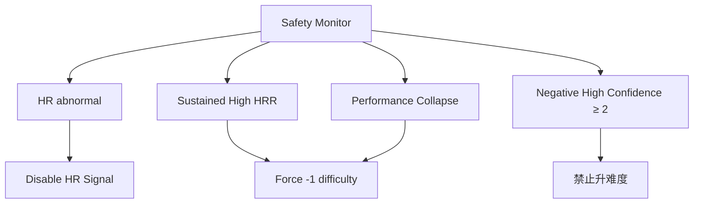

# 《面向老年认知训练的多模态闭环动态难度系统：基于 Hierarchical State Estimation 与 Evidence Fusion 的方法框架》

# 1. 研究问题（Research Problem）

在老年认知训练中，动态难度调整（Dynamic Difficulty Adjustment, DDA）的核心目标不是让任务越来越难，而是让老年用户在长期训练过程中持续维持可接受负荷与积极参与状态。也就是说，系统真正需要解决的问题是：

1. 用户现在还有没有能力继续训练？(Can Continue)
2. 用户现在还愿不愿意继续训练？(Want Continue)

##  

# Hierarchical State Estimation（分层状态估计）是什么

# 什么是 Hierarchical State Estimation？

（Hierarchical State Estimation，HSE）

简单说它不是直接根据输入调难度，而是先理解用户现在是什么状态，再决定如何调整。即错误做法是数据 → 直接调难度，正确做法是数据 → 状态估计 → 策略决策 → 调难度。这是“状态驱动系统”而不是“规则驱动系统”。这是近几年 adaptive tutoring system、intelligent rehabilitation、digital therapeutics、affective computing、human-centered AI 最主流的范式。

原因是人不是固定系统，同样表现可能代表不同状态。例如同样 accuracy = 60%，情况 A 积极、HR稳定、RT正常，说明只是题略难，继续训练有价值；情况 B 消极高信度、HRR高、RT显著变慢，说明已接近认知疲劳，应该降难度。所以不能只看结果，必须看“状态”。

# 5. HSE 的核心思想

HSE 本质是分层推理（Hierarchical Inference）。系统不直接问“难度该不该升？”，而是先逐层回答：第一层信号可靠吗？第二层他有没有能力继续？第三层他愿不愿意继续？第四层现在处于什么体验状态？第五层该怎么调整？

所以完整逻辑是：感知层 → 信号可靠性层 → 用户状态层 → 心流状态层 → 策略层 → 难度调整。这就是 Hierarchical State Estimation。

# 6. 为什么它比简单加权更科学

很多系统会这样：

```text
DifficultyScore =
0.3×accuracy
+0.2×emotion
+0.2×hrr
+0.3×rt
```

然后 score > threshold 升难度。这种叫 Linear Weighted Fusion（线性加权融合），看起来很合理，其实问题很大。

## 问题1：不同变量意义不同

例如 accuracy 表示能力，而 emotion 表示意愿，不是一回事，不能直接加，相当于速度 + 开心 = ?，没有意义。所以必须先建 latent state（潜在状态）即 Can Continue、Want Continue，再融合。

## 问题2：生理不能直接解释

例如心率升高可能是好事（投入、兴奋、挑战），也可能是坏事（焦虑、疲劳、压力），所以 HR 不能单独解释，必须联合上下文 contextual interpretation。例如情况1 HR↑、Accuracy↑、Emotion positive = engagement；情况2 HR↑、Accuracy↓、Negative emotion = overload。这是证据融合的核心思想。

## 问题3：老年场景特别强调安全

你的系统不是竞技游戏，而是健康导向认知训练，所以系统目标不是 maximize challenge，而是 maximize sustainable engagement，即长期可持续训练。因此解释性与安全性比刺激更重要，HSE天然适合。

# 7. 为什么 HSE 是当前前沿方法

你担心会不会太“自己想的”？答案是不会，实际上这是当前广泛认可路线，只是名字不同。

## （1）Adaptive Tutoring Systems

智能教学系统普遍先估计 knowledge state、emotion state、engagement，再调内容，而不是直接看分数，代表是 Intelligent Tutoring System。

## （2）Digital Therapeutics

数字疗法尤其认知康复，常见 user state modeling，例如估计 fatigue、stress、motivation、cognitive workload，再调整任务。

## （3）Affective Computing

Picard 提出 physiology 不应该直接驱动 action，而是推断 affective state 再决策，这是你系统的重要依据。

## （4）Adaptive Automation

航空、驾驶经典流程：physiology、performance、context → workload estimation → automation adaptation，和你非常像，只不过你是 difficulty adaptation。

# 8. 什么是 Evidence Fusion（证据融合）

现在进入第二个核心 Evidence Fusion，它解决的问题是多模态冲突。例如情况1 Accuracy 高、Emotion 差；情况2 Emotion positive、Accuracy 崩；情况3 HR abnormal，怎么办？如果直接加权很容易出错，因此需要证据融合，即每个模态都只是“证据”不是真相，系统综合多个证据推断 latent state（潜在状态）。

# 9. 证据融合 ≠ 加权平均

错误理解是 0.3A + 0.3B + 0.4C，不是。真正的 Evidence Fusion 更像法官审案。例如证据 Accuracy 下降，说明可能过难；但另一个证据 Emotion positive，说明还愿意继续；再加 HRR moderate，说明没超负荷。最终推断 challenge but okay，保持而不是马上降难度，这才符合心流。

# 10. Evidence Fusion 在你的系统怎么做？

你现在其实已经有非常完整数据，可以构建三层证据系统。

## 第一类证据：能力证据（Can Continue）

回答能不能完成？来源：Accuracy trend（最近5题趋势，比平均值重要）、RT trend（是否越来越慢）、Difficulty tolerance（高难度是否崩）、HRR（负荷是否过高）、HR slope（压力变化趋势）。

## 第二类证据：动机证据（Want Continue）

回答想不想继续？来源：Positive high confidence（强 engagement）、Negative high confidence（强 withdrawal）、HR arousal（轻微激活好，太高压力，太低无聊）、RT hesitation（是否拖延）。

## 第三类证据：风险证据（Risk Layer）

回答有没有危险？来源：hr abnormal、sustained overload（长期高HRR）、negative high confidence（连续出现）、sharp decline（表现崩塌）。这层优先级最高，因为老人安全第一。

# Part 3 / 面向你的 perception.py 的状态建模

# 如何真正构建 Can Continue 与 Want Continue

现在开始进入可实现层（Implementation Layer），这一部分会直接对应你现在已有的数据结构。你当前已经有 perception.py，输出包括生理（hr_signal：正常/异常、hrr：低强度/中等强度/高强度、hrslope：快速下降/缓慢下降/稳定/缓慢上升/快速上升）、情绪（你已经做了情绪势场（emotion field）得到积极高信度/积极低信度/中性/中性高信度/消极低信度/消极高信度，这个方向是对的，但要重新定义用途）、认知（游戏 demo 你有总得分、当前实时难度、总准确率，以及逐题 reaction_time、correct/wrong、difficulty、score，这已经足够，实际上比很多论文数据更完整）。

# 11. 系统整体逻辑（最终版）

你的系统建议最终结构：感知层（生理 + 情绪 + 认知）→ Reliability Gate（信号可靠性门控）→ Can Continue（能力状态）→ Want Continue（意愿状态）→ Flow State Estimation（心流估计）→ Difficulty Policy Engine（难度策略引擎）→ Difficulty 1–8。重点是不直接调难度，而是先估计状态，这是整个系统最核心的升级。

# 12. 第一层：Reliability Gate（信号可靠性门控）

这一层非常关键，很多论文忽略，但你必须做，因为你的 hr abnormal 已经证明生理信号不总是可信。为什么要门控？假设某次 rPPG 丢帧，结果 hrr = 0、hrslope = 0，如果系统认为用户不累，就会错升难度，很危险。所以第一步不是看数据值，而是看可信度。

## Reliability Gate 逻辑：定义生理可靠性，如果 hr_signal == "正常" 则 physiology_reliable = 1，否则 physiology_reliable = 0，即异常时生理直接失效，只保留认知 + 情绪，这是 evidence discounting（证据折损），是 multimodal fusion 常用方法。

## 为什么不能强行插值？

有人会用上一帧代替或均值代替，对你不建议，因为老人状态变化可能是真实的，宁可暂时不用生理，也不要误判。

# 13. 第二层：Can Continue（有没有能力继续）

这是整个系统最核心状态，它回答用户现在还能不能有效训练？注意不是能不能答对，而是是否仍处于有效认知区间。

## 13.1 为什么“能力”比正确率复杂？

例如老人 accuracy = 80%，但 RT 越来越慢、HRR 高、hrslope 快速上升，说明在硬撑，实际上已接近超负荷。如果你继续升难度，极容易 frustration、withdrawal，所以 Can Continue 是 latent state（潜在状态），必须多证据融合。

# 14. Can Continue 用哪些变量？

推荐一级强证据（核心）：

## 1. Accuracy Trend

不是总准确率，而是最近5题趋势，因为总准确率反应慢、不敏感。建议保存 last_5_accuracy，例如 1 1 1 0 0 最近变差就危险。为什么是趋势？认知衰退通常是 gradual decline 而不是瞬间崩，所以重点是 slope 不是平均值。

## Accuracy Score 建议：≥90% +30，70–90% +20，50–70% +10，<50% 0。

## 2. Reaction Time Trend（重要）

很多系统低估 RT，其实对于老人 RT 非常关键，因为认知疲劳最先表现变慢，比正确率更早出现。不要看单题RT，看 difficulty-normalized RT 即归一化，公式 RT_ratio = RT_current / RT_expected(difficulty)。例如难度3正常8s，老人12s，ratio = 1.5 说明吃力。

## RT Score：<0.8 +25，0.8–1.2 +20，1.2–1.5 +10，>1.5 0。

## 3. Difficulty Tolerance

关键创新，定义为难度提升后是否稳定。例如 difficulty 4 → 5 后准确率崩，则说明5太难，这是个体能力边界，特别重要。Score：稳定 +20，略降 +10，崩塌 0。

## 4. HRR（辅助）

你现在三档（低强度/中等强度/高强度，很好，不用数值，建议中等最好，因为心流不是最低负荷，而是 moderate challenge。Score：中等 +15，低 +8，高 0。

## 5. HR Slope（修正变量）

你说 -3 → 0 → +3 → 0 来回跳，非常正常，因为 slope 本来就噪声大，所以千万不要逐帧用，必须 EMA 平滑，公式 EMA_t = α x_t + (1-α) EMA_{t-1}，建议 α = 0.2，窗口 20–30秒，然后只取平滑结果。Score：稳定 +10，缓慢上升 +8，快速上升 -5，快速下降 -5。

# 15. Can Continue 总公式

注意不是简单加权，是 evidence score 即证据支持程度，最终 CanContinue = Accuracy + RT + Tolerance + HRR + HRslope，范围 0–100。

## 状态划分：>75 Strong（可以挑战），55–75 Capable（最佳训练区，心流目标），35–55 Struggling（开始困难，谨慎），<35 Overloaded（应该降负荷）。

# Part 4 / Want Continue（愿不愿意继续）

# 如何估计参与度、情绪、坚持意愿与放弃风险

这一部分是你整个系统最容易做错的地方，因为很多系统默认开心 = 想继续、难过 = 不想继续，这是错误的。在认知训练中，适度紧张其实是好的，而一直开心反而可能说明太简单。所以你的目标不是让老人一直开心，而是保持适度挑战 + 可持续参与，这正是 Want Continue（继续意愿状态）。

# 16. 为什么必须单独建模 Want Continue？

你已经意识到能不能继续玩和想不想继续玩是两回事。例如情况 A：老人 accuracy = 90%，但 RT越来越慢、无积极情绪、HRR极低，说明太简单、无聊，虽然能继续，但不想继续，这叫 disengagement（脱离参与）。情况 B：老人积极高信度，但 accuracy 崩、RT显著上升、HRR高，说明过载，如果继续升难度容易挫败。所以 Can Continue 解决身体和认知还能不能撑住，Want Continue 解决心理上还愿不愿意投入，两者必须解耦，这是现代 adaptive system 共识。

# 17. Want Continue 到底是什么？

它本质是 Engagement State（参与状态），包含兴趣、投入、坚持意愿、挫败风险、退出风险，目标推断用户是否仍愿意参与，而不是开心不开心。

# 18. 你的情绪势场该怎么用？

你说只有积极高信度和消极高信度有用，这个判断基本正确，但需要升级。你现在有积极高信度、积极低信度、中性、中性高信度、消极低信度、消极高信度，建议改成三类证据：第一类强情绪证据（Strong Affect）：积极高信度说明 engagement↑、motivation↑，给强正向证据；消极高信度说明 frustration、withdrawal risk，给强负向证据。第二类弱情绪证据（Weak Affect）：积极低信度不要忽略但降权，说明可能开心但不确定，只能弱支持；消极低信度同理，说明可能开始烦了但不能直接降难度。第三类不确定状态：中性、中性高信度不要认为没用，这是你现在一个重要误区。在认知训练中，中性往往是正常状态，特别高专注时表情常常 neutral，不代表不开心，可能是 deep engagement（深度投入），所以中性高信度应该轻度正向而不是 0，这是很多 affective computing 研究发现的问题：老年人专注状态表情变化小，尤其侧脸、低头。

## 推荐情绪评分：积极高信度 +35，积极低信度 +15，中性高信度 +10，中性 +5，消极低信度 -15，消极高信度 -40。注意消极高信度惩罚很强，因为老人挫败代价很高。

# 19. HR 在 Want Continue 的作用

重点：HR ≠ 压力，也可能兴奋，所以 HR 只能辅助解释 engagement。关键是 moderate arousal 最佳即适度激活，符合 Yerkes–Dodson Law（倒U曲线），不是越高越好也不是越低越好，你的 HRR 正好适用。

## HRR 在意愿层的解释：低强度说明 under stimulation 可能无聊但也可能轻松，给中等分；中等强度最好，代表 optimal arousal 最接近心流；高强度不一定坏，但长期危险，因此降分。推荐：中等 +20，低 +10，高 -15。

# 20. RT 能反映“想不想继续”

这是很多人忽略的，但非常强，因为不想玩首先出现 hesitation（犹豫），表现 RT变慢，特别正确率还没掉时，这是很强信号。判断最近5题 slope，如果越来越慢说明可能 withdrawal。RT engagement score：更快 +15，稳定 +10，略慢 -5，明显慢 -15。

# 21. Accuracy 在意愿层的作用

注意这里 accuracy 不是能力，而是 self-efficacy（自我效能），长期做不对会我不行，老人特别明显，所以低正确率影响愿意继续，但权重低于情绪。Score：>85% +15，65–85% +10，50–65% 0，<50% -10。

# 22. Want Continue 总公式

最终动机 > 生理 > 行为，建议：Emotion + HRR + RT engagement + Accuracy confidence，范围 0–100。推荐权重：Emotion 45%，HRR 20%，RT trend 20%，Accuracy 15%。原因：情绪最能预测退出，其次生理激活，最后行为。

## 状态划分：>75 Highly Engaged（可升难度），55–75 Engaged（最佳状态，目标区），35–55 Passive（可能无聊，也可能轻疲劳，观察），<35 Withdrawal Risk（危险，可能准备放弃，需要降难度 + 鼓励反馈，例如“做得很好，我们换一个简单一点的试试。”）。

# 23. 关键：心流不是开心

很多毕设这里会错，心流不是 positive emotion，而是挑战 × 能力匹配，所以真正心流往往是中性高信度 + 中等HRR + RT稳定 + 高准确率，而不是一直笑，这是非常重要的理论点。

# Part 5 / Flow State Estimation（心流状态估计）

# 如何真正让老人进入“适度刺激 + 成就感”的状态

到这里你已经有两个核心状态：Can Continue（有没有能力继续）、Want Continue（愿不愿意继续），但还不能直接调难度，因为你的目标不是单纯让用户继续，而是进入长期有效训练状态，也就是心流（Flow）。

# 24. 心流到底是什么？

很多人误解开心 = 心流，错误。真正 Flow Theory 的核心是挑战（Challenge）与能力（Skill）的动态平衡。当太简单出现 boredom（无聊），太难出现 anxiety（焦虑），正好进入 flow（沉浸区）。对于老人还要增加疲劳风险，所以你需要四状态心流模型而不是传统二维。

# 25. 适老版心流模型（推荐）

建议定义4个核心状态：

## 1. Boredom（无聊）

定义：Can Continue 高、Want Continue 下降、HRR低、RT越来越慢。典型特征：题太简单，老人虽然 accuracy 很高但开始“机械作答”，这是认知训练最大问题，因为没有效训练。策略：升难度 + 适度激励（例如“你完成得很好，我们试试更有挑战的。”），注意老人不要太竞技。

## 2. Flow（最佳状态）

定义：Capable + Engaged + Moderate HRR + Stable RT + No frustration。典型：accuracy 70–85%、RT稳定、中性高信度、HRR中等。注意不一定很开心，很多真正专注是 neutral。策略：保持，不要频繁升难度，因为老人适应速度慢。

## 3. Anxiety（焦虑）

定义：Can Continue下降、Want Continue下降、HRR高、hrslope上升、消极高信度出现。说明开始吃力但还没彻底崩，这是最关键窗口。策略：微调降难度（-1而不是-2），同时正向反馈（例如“刚刚已经很不错了，我们调整一下。”）。

## 4. Fatigue（疲劳/超负荷）

定义：Overloaded + Withdrawal Risk + 持续高负荷。特征：accuracy 崩、RT显著上升、消极高信度连续、HRR高、hrslope持续上升。说明已接近放弃。策略：强制降难度（-2）甚至暂停建议（例如“休息一下再继续也可以。”），适老非常重要。

# 26. 如何融合 Can Continue + Want Continue？

现在核心来了，你最终不能加权，而是状态映射，即二维状态空间，横轴 Can Continue，纵轴 Want Continue。

## 状态矩阵（核心）

| Can Continue | Want Continue  | 状态        |
| ------------ | -------------- | --------- |
| Strong       | Highly Engaged | boredom   |
| Strong       | Engaged        | flow      |
| Capable      | Engaged        | flow      |
| Struggling   | Engaged        | challenge |
| Struggling   | Passive        | anxiety   |
| Overloaded   | Passive        | fatigue   |
| Overloaded   | Withdrawal     | fatigue   |

注意不完全对称，因为老人安全优先。

## 为什么 Strong + Highly Engaged 是 boredom？

很多人会觉得不是应该更好？不，因为说明能力远高于挑战，这意味着难度太低，应该升，否则认知收益低。

# 27. Difficulty Policy Engine（真正调难度）

现在终于进入难度控制，你的难度 1–8，建议不允许大跳，即默认 ±1，只有 fatigue 允许 -2。

## 难度策略表

| State     | 动作 |
| --------- | -- |
| boredom   | +1 |
| flow      | 0  |
| challenge | 0  |
| anxiety   | -1 |
| fatigue   | -2 |

解释：challenge 为什么不升？因为挑战感本来就是心流边缘，急着升容易掉进焦虑，特别老人。

# 28. 防抖机制（必须做）

这是很多系统翻车原因，如果逐题调会出现 4→5→4→5→4 疯狂震荡，体验极差。推荐连续状态确认规则：boredom ×2 才 +1，anxiety ×2 才 -1，fatigue ×2 才 -2，这样系统更稳，老人更舒服。

# 29. 时间窗口到底多长？

你是离散逐题，建议决策窗口 = 最近5题。原因：单题噪声太大，例如突然看错不能直接降难度。为什么不是10题？太慢，认知状态已经变了。为什么不是3题？太敏感，容易抖。5题最稳，也是认知训练常见窗口。

# 30. 危险保护机制（适老必须）

你的系统最好加 Safety Override，优先级高于一切。

## Rule 1：hr abnormal 连续出现（>3次），则暂停生理决策。

## Rule 2：高负荷持续（HRR高 + hrslope持续上升）超过60秒，则强制降级。

## Rule 3：消极高信度连续（>=2），禁止升难度。

## Rule 4：accuracy 崩塌（最近5题 ≤20%），立即 -1，避免挫败。

# 31. 老年适配最重要原则

一句话：宁可略简单，也不要长期挫败。因为研究一致发现老人挫败后退出率很高，而稍简单仍有训练收益。所以策略：保守升难度，积极降难度，即升难度慢、降难度快，这是你系统很重要的论文贡献点。

---

# Level 0：Overall Architecture State Machine

```mermaid
flowchart TD
    A[Perception Layer] --> B[Reliability Gate Layer]
    B --> C[Can Continue / Want Continue]
    C --> D[Flow State Estimation]
    D --> E[Difficulty Policy Engine]
    E --> F[Difficulty 1-8]
    
    subgraph A[Perception Layer]
        A1[Physiology]
        A2[Emotion]
        A3[Cognition]
        A1 --> A1a["HR Signal (normal/abnormal)"]
        A1 --> A1b["HRR (low/medium/high)"]
        A1 --> A1c["HR Slope"]
        A2 --> A2a["Positive High Confidence"]
        A2 --> A2b["Positive Low Confidence"]
        A2 --> A2c["Neutral / Neutral High"]
        A2 --> A2d["Negative Low Confidence"]
        A2 --> A2e["Negative High Confidence"]
        A3 --> A3a["Accuracy"]
        A3 --> A3b["Reaction Time"]
        A3 --> A3c["Difficulty (1-8)"]
        A3 --> A3d["Answer History"]
    end
    
    subgraph B[Reliability Gate Layer]
        B1{"HR abnormal?"}
        B2[YES: Physiology Weight = 0]
        B3[NO: Full Evidence Fusion]
        B1 -->|YES| B2
        B1 -->|NO| B3
    end
    
    subgraph C[Can Continue / Want Continue]
        C1[Can Continue]
        C2[Want Continue]
        C1 --> C1a[Strong]
        C1 --> C1b[Capable]
        C1 --> C1c[Struggling]
        C1 --> C1d[Overloaded]
        C2 --> C2a[Highly Engaged]
        C2 --> C2b[Engaged]
        C2 --> C2c[Passive]
        C2 --> C2d[Withdrawal Risk]
    end
    
    subgraph D[Flow State Estimation]
        D1[boredom]
        D2[flow]
        D3[challenge]
        D4[anxiety]
        D5[fatigue]
    end
    
    subgraph E[Difficulty Policy Engine]
        E1["boredom → +1"]
        E2["flow → 0"]
        E3["challenge → 0"]
        E4["anxiety → -1"]
        E5["fatigue → -2"]
    end
```



---

# Level 1：Reliability Gate State Machine



---

# Level 2A：Can Continue State Machine



## Can Continue Transition Rules



---

# Level 2B：Want Continue State Machine



## Want Continue Transition Rules



---

# Level 3：Flow State Machine（核心）



### 状态映射矩阵

| Can Continue | Want Continue   | Flow State |
| ------------ | --------------- | ---------- |
| Strong       | Highly Engaged  | boredom    |
| Strong       | Engaged         | flow       |
| Capable      | Engaged         | flow       |
| Struggling   | Engaged         | challenge  |
| Struggling   | Passive         | anxiety    |
| Overloaded   | Passive         | fatigue    |
| Overloaded   | Withdrawal Risk | fatigue    |

---

# Level 4：Difficulty Transition State Machine



---

# Level 5：Anti-Oscillation State Machine（防抖）



---

# Level 6：Safety Override Machine（最高优先级）



---

这就是完整状态机。

从论文角度，它已经是一套完整的 Hierarchical State Machine + Evidence Fusion 架构，而不是“规则堆砌”。
